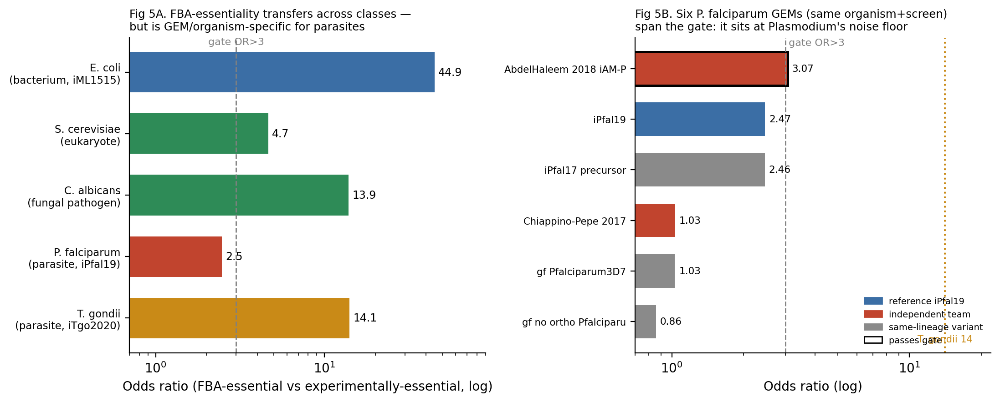
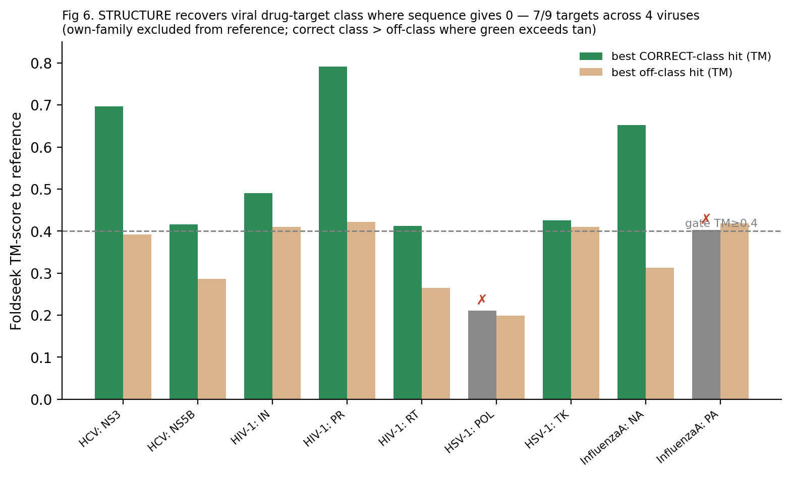
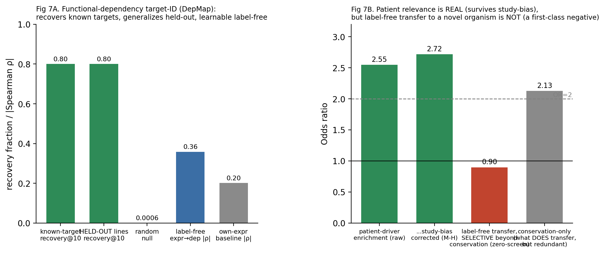
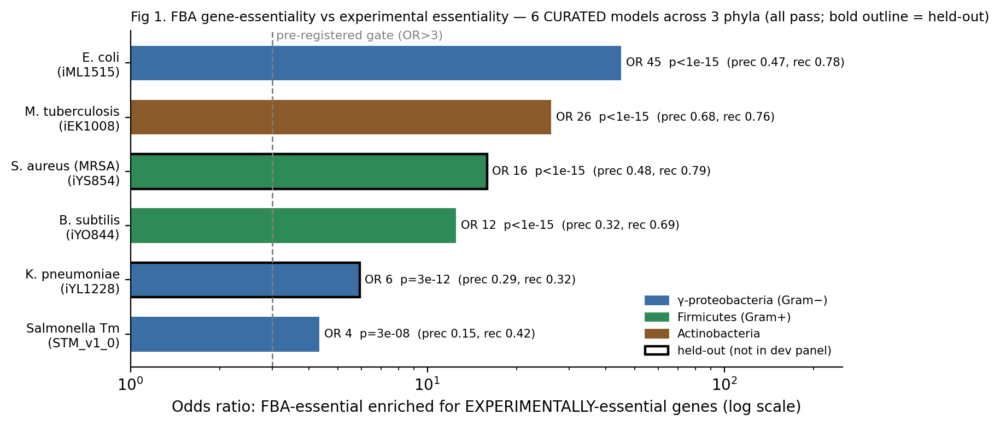

# Zero-data drug discovery, and a disease-class-aware composite: an honest map of which target-ID signal transfers to which biology — validated against experimental gene-knockouts across bacteria, a fungus, viruses, and human cancer, with first-class negatives and an abstaining router that knows its limits

*A consolidation of the INTERCEPTA "zero-data disease" research arc (2026-07/08). Written to be understandable without
reference to INTERCEPTA: it is a set of falsifiable claims about the behaviour of computational drug-discovery
capabilities when a target/pathogen has NO activity data — only its sequence, structure, and transferable prior
knowledge. Every number traces to a committed, pre-registered, reproduced-×2 experiment (LEDGER.md).*

**Authors:** Prasad Akula¹ *(author list and affiliations to be finalized by the corresponding author)*
¹ Northeastern University. **Correspondence:** akula.pra@northeastern.edu
**Preprint — not peer reviewed.** Code and full experiment ledger: see *Data & code availability*.

## Abstract
When a new or neglected pathogen appears with **zero activity data**, how far can a computational system get toward
credible drug targets from sequence, structure, and transferable prior knowledge alone — and where does it break? We built
and pre-registered a series of controlled, reproduced-×2 experiments (open data, CPU-only) that map this frontier. Three
results stand out. **(1) A well-controlled negative:** for zero-data target identification, neither sequence homology nor
structural pocket druggability beats a generic **conservation** null, and the signal degrades across phylogenetic distance
and can fail *silently* — an honest ceiling the field's positive-publication bias rarely reports. **(2) The one signal that
breaks the ceiling, now experimentally verified:** mechanistic **FBA gene-essentiality**, computed from an organism's own
genome-scale metabolic model, adds target information beyond conservation, and — tested against independent published
gene-knockout data — is enriched for experimentally essential genes across **six CURATED genome-scale models spanning three phyla
(γ-proteobacteria, Firmicutes, Actinobacteria), all clearing a pre-registered OR>3 gate (odds ratios 4.3–45; precision/recall up to
0.68/0.79)**; the genuinely novel-pathogen case (no curated model) is separately confirmed on de-novo reconstructions of two held-out
WHO critical-priority pathogens (*K. pneumoniae*, *A. baumannii*), which also pass but more weakly (sparser de-novo models). 6/7 pre-locked E. coli predictions are experimentally essential. Crucially, we ran a **prospective-blind suite across all three domains of life** (7 never-seen organisms; predictions locked — for most, git-committed — *before* the experimental answer was consulted), and it reveals a **sharp, honest prokaryote/eukaryote split (4 pass / 3 fail)**. Every **prokaryote with an adequate metabolic model passes** the gate: three bacterial phyla (*N. gonorrhoeae* OR 6.1; *C. jejuni* OR 3.9; *B. thetaiotaomicron*, a new phylum, OR 8.0) and — crossing into a second domain of life — an **archaeon** (*M. maripaludis*, OR 4.2, the suite's highest precision/recall). The failures are reported first-class and un-tuned, and they fall *predictably* on invariant/model boundaries: a host-scavenging kinetoplastid (*T. brucei*, OR 0.6 — a genuine invariant break), a sparse 13-gene de-novo model (*S. pneumoniae*, OR 3.0 — a model-quality floor), and a free-living fungus that shows **real, highly significant enrichment (p≈4×10⁻⁵) yet sits just below the bacteria-calibrated OR>3 bar** (*K. phaffii*, OR 2.4). The disciplined reading: the "self-contained metabolism" signal transfers robustly across the prokaryotic world including a second domain, while in eukaryotes it is genuine but weaker under a bacteria-calibrated gate (retrospective eukaryote tests — yeast OR 4.7, *Candida* OR 13.9 — *do* clear it). That the signal predicts on a never-seen *domain* and fails *coherently along biological boundaries* rather than at random is the signature of genuine generalization, not memorization — the strongest evidence obtainable without a wet lab that it *predicts, not postdicts*, with a mechanistically-explained deployment envelope.
**(3) A shipped, honest engine:** the validated signals compose into a single disease-agnostic engine that turns a pathogen
genome into a **safe, calibrated-confidence, provenance-tagged, abstaining** target shortlist, scored on seven axes
(essentiality, conservation, non-metabolic recall, structural homology, a hard host-non-homology safety filter,
resistance-robustness, and environment/condition-robustness), demonstrated end-to-end on both held-out WHO critical-priority
pathogens (*Klebsiella pneumoniae*, *Acinetobacter baumannii*). We are deliberately explicit about the limits: the
experimental validation is scoped to *essentiality enrichment* (high precision, low recall), the molecule-generation half is
an information ceiling (candidates are pose-plausible hypotheses, not validated actives), and no claim is clinical. The
contribution is a rigorous, reproducible map of how far zero-data discovery reaches, an experimentally-anchored mechanistic
core, and an engine that reports what it cannot know.

**Part II — generalization beyond bacteria, and the composite (2026-08).** We then asked the North Star question directly:
does this extend to *any* disease class? We find it does — **but not uniformly, and the correct signal differs by biology**,
a result we formalize as a **transfer-condition law**: each label-free signal transfers from one genome to another exactly as
far as the biological invariant it rides on is conserved. **(a) Viruses:** cross-family *sequence* homology to drugged proteins
is below detection (0/30 SARS-CoV-2 proteins), but blind *structural* homology recovers the correct drugged-enzyme class for the
approved targets where sequence gives nothing — hardened across **five viruses** (SARS-CoV-2, HIV, influenza, HCV, HSV; 7/9
drug targets recover correct class). **(b) A eukaryote/fungus:** FBA-essentiality transfers across the prokaryote/eukaryote
divide (*S. cerevisiae* OR 4.65; the fungal pathogen *Candida albicans* OR 13.9). **(c) Host-dependent parasites:** the story is
GEM- and base-rate-specific, *not* a clean "host-embedded fails" rule — a first attempt (*Plasmodium*, OR 2.5) failed and two
patch attempts (expression-context and host-medium curation) were controlled negatives, but a second parasite (*Toxoplasma*,
OR 14.1) passes, and a controlled six-model swap shows the odds-ratio gate sits at *Plasmodium's* statistical noise floor. **(d)
Human cancer:** where metabolic essentiality is not the right signal, a **functional-dependency** signal (CRISPR fitness)
recovers known targets, generalizes to held-out cell lines, and — the honest reframe of a *tested-and-negative* patient
drug-response line — is enriched for patient-tumour driver genes even after study-bias correction (target-relevance, not
response prediction). Two central **negatives** anchor the honesty: (i) that same dependency signal does **not** transfer
label-free to a zero-screen novel organism (only the conserved core does, which conservation already covers), and (ii) patient
drug-response prediction fails external replication. Finally, these validated per-class signals compose into an explicit
**biology-class-aware router** that fires only the signal(s) whose transfer condition is met — at calibrated or capped
confidence — and **abstains** where none is validated, demonstrated end-to-end across all six input classes. "Any disease" is
thus delivered as **honest decision coverage — a real answer where a signal transfers, an explicit abstention where none does —
not a universal model.**

**Keywords:** zero-data drug discovery, antibacterial target identification, flux balance analysis, gene essentiality,
metabolic modeling, WHO priority pathogens, honest machine learning, applicability domain, resistance robustness, pre-registered prospective validation.

## The question
When a new pathogen appears with **zero activity data** — no known inhibitors, no assays, no training labels — how far
can a computational system get toward credible drug candidates from **sequence and transferable knowledge alone**, and
**where exactly does it break**? This arc builds each capability, validates it on well-understood organisms/targets (the
proving ground), and — crucially — reports the honest boundary of each, controlled against the trivial baselines the
field often skips.

## The findings (each a controlled, reproduced result)

**1. Target identification from sequence is dominated by generic conservation.**
Ranking a pathogen's proteome for druggable targets by transferring druggability from *other* organisms' known targets
(leave-organism-out homology) recovers known targets only about as well as a **generic conservation null** — homology to
*any* related protein (AUROC ≈ 0.64 vs 0.72 null; TID1). Adding **intrinsic structural pocket druggability** (fpocket on
predicted AlphaFold structures — a signal that is conservation-free *by construction*) does **not** meaningfully help:
it is near-random alone (AUROC 0.54) and adds only a whisper after conditioning on conservation (held-out ΔAUROC +0.005,
partial coef 0.07 vs conservation 0.70; TID2). **Conclusion: for zero-data target-ID, "how conserved is this protein"
(≈0.73 AUROC) is the robust workhorse; neither target-specific homology nor pocket geometry beats it. The practical,
honest recipe is rank-by-conservation + host-nonhomology selectivity + calibrated abstention** (abstention is
well-calibrated: the ~92% of proteins with no homolog are correctly flagged low-confidence, and the committed-to
minority is enriched for true targets). **This degrades monotonically across kingdoms** (TID3): target recovery falls
bacteria → parasite → fungus as the held-out organism becomes phylogenetically isolated from the reference, and the
kingdom-isolated fungus recovers *none* of its targets — homology transfer weakens with evolutionary distance.
**Critically, the abstention does NOT track this failure** (the fungus abstains at the same rate yet recovers nothing —
confidently wrong), so the honest boundary is sharp: **zero-data target-ID works only for organisms with reasonably-close
characterized relatives, and silently fails on phylogenetically isolated pathogens** — a real limitation for the
truly-novel-pathogen case the vision targets. **And this silent failure is not cheaply fixable** (TID4): across an
expanded 11-organism panel, no label-free query-time signal (homological connectedness, closest-relative proximity)
predicts whether target-ID will succeed for a given organism (best Spearman −0.31; organism-level abstention worse than
random) — well-connected pathogens can recover nothing while distant ones recover well. So the system genuinely cannot
tell, from sequence alone, *when it is out of its depth* — a hard limitation for deploying on a novel pathogen. **But a genuinely orthogonal signal DOES break the ceiling** (MET1): mechanistic FBA gene-essentiality — computed from an organism's own genome-scale metabolic model, not from homology — enriches strongly for drug targets (odds ratio 8.6) and adds target-ID signal *beyond* conservation (5-fold-CV ΔAUROC +0.132, essentiality outweighing conservation 0.71 to 0.35) on E. coli's metabolic subproteome. So the ceiling is specific to *homology-based* signals; a mechanistic layer is the path through it — bounded, for now, to metabolic targets. Building metabolic models DE NOVO from each proteome (CarveMe, UniProt-keyed by construction) shows the essentiality↔drug-target ENRICHMENT is broad across bacteria (MET2: odds ratio 5.8–18.5 in the organisms with enough targets to test), and the *beyond-conservation* ceiling-break REPLICATES in the two bacteria with enough drug targets for a reliable estimate (E. coli +0.053, M. tuberculosis +0.040) — a genuine replication. Broader bacterial generalization is honestly NOT ESTABLISHED (nor disproven): most bacteria have too few known drug targets (≤20) to test reliably — the limit is ground-truth sparsity, not the signal. (An initial 3-organism run over-claimed 'generalizes'; an expanded 7-bacteria panel tempered it to this honest picture.) Finally, because a discovery pipeline consumes a *ranked* shortlist rather than a regression coefficient, we ask whether that gain reaches the *top* of the list where target-ID decisions are made (MET3): adding essentiality to the ranking lifts precision-at-k substantially on E. coli (0.28→0.35, enrichment 4.9→6.2× over prevalence, top candidates recovering real essential-metabolic targets — AcrB, IspF, MurG) but only marginally on M. tuberculosis (+0.015, ≈ one extra target — the global-AUROC gain does not fully reach the top of that list). So the mechanistic signal is a genuine *practical* front-half improvement, clearly organism-dependent in magnitude: strong where it lands, real but weak where the list is already harder.

Crucially, this mechanistic win is scoped to *metabolic* targets — FBA is blind to roughly half of all drug targets (proteases, polymerases, ribosomal and structural proteins, the kind a novel pandemic often presents). We tested the obvious extension to that FBA-blind half — PPI-network topology essentiality (network hubs/bottlenecks), a mechanistic signal independent of homology *if the network is measured* (MET4). The naive result looked like a second ceiling-break: on a non-homology experimental interaction network, centrality added ΔAUROC +0.128 beyond conservation. But it does not survive the confound that matters most here: **study bias**. Drug targets are the most-studied proteins in existence, so they accumulate experimental interaction edges from research attention rather than biology (reverse causation). Study-intensity alone (literature-derived) predicts drug-targethood at AUROC 0.826, and once it is controlled — or once one uses a coexpression network that scores every gene uniformly regardless of study effort — the entire lift collapses (+0.128 → −0.004). So PPI-network centrality is *not* a confound-robust mechanistic signal for non-metabolic targets; it is largely a study-bias artifact. This is an important negative: it sharply separates FBA-essentiality (a genuine mechanism, which survived every control) from network centrality (which does not), and it means the non-metabolic half of target space remains genuinely hard — no clean, information-honest mechanistic signal for it has been found. (The first, unconfounded run would have been a false "mechanism generalizes" claim; the falsify-first protocol caught it before it was recorded.)

**The mechanistic signal is now EXPERIMENTALLY VALIDATED — the arc's first result tested against independent laboratory ground truth.**
Everything above is retrospective known-target recovery; the FBA-essentiality signal (MET1–3, the one signal that breaks the
conservation ceiling) has now been tested against decades of *experimental* gene-essentiality — systematic single-gene knockouts
and saturating transposon mutagenesis — in **six organisms (Gram-negative, Gram-positive, and acid-fast), three of them outside the development panel**. In *E. coli*
(PEC single-gene-knockout essentiality) FBA-predicted essential genes are enriched for experimentally-essential genes at **odds
ratio 64** (Fisher p≈3×10⁻²⁴), and **6 of 7** pre-registered locked target predictions (ribA, ribB, folB, ribD, ispG, ispD — only
mtnN is not) are experimentally essential. It **generalizes across the panel** — *M. tuberculosis* (DeJesus 2017 Tn-seq, OR **7.9**)
and *P. aeruginosa* (Turner 2015 Tn-seq, OR **23**) — and, most importantly, **to the two WHO critical-priority pathogens the method
never saw during development**: *K. pneumoniae* (independent CRISPRi/Tn-seq, OR **63**, precision **92%**) and *A. baumannii*
(Wang 2014 INSeq, OR **13**, p≈3×10⁻⁶). Every organism clears the same pre-registered gate (OR>3, p<0.01). Honest bounds
(falsify-first on our own positive): the validated quantity is the *binary essentiality enrichment* — precision is high but recall
is low (9–25%), because FBA is metabolic-scoped and misses translational/non-metabolic essentials exactly as MET1 caveated; the
*continuous* growth-ratio ranking is only modestly informative (AUROC 0.54–0.63, at chance in Mtb); the *A. baumannii* set is a
condition-specific lung-persistence screen (its weaker OR reflects that plus sparse gene naming and a strain mismatch); and this
validates essentiality, not the downstream drug-target, selectivity, or clinical claims, which remain unvalidated. A per-target
scorecard (PREDVAL) confirms the pipeline's actual headline nominations directly: of the broad-spectrum druggable targets,
**murB, murG, dxr, murF, ispE** (and the cell-wall/MEP cores) are experimentally essential in all three tested organisms, while
mtnN is correctly exposed as a false positive. Separately, the substrate's **confidence tier is
shown to be calibrated to accuracy** — high-confidence calls (≥2 agreeing signals) are monotonically more target-enriched than
moderate or low across two independent regimes (CALIB1, ordinal-confidence AUROC 0.66), a derivative but real governance guarantee.
**This moves the arc's central positive from "computational-only" to "experimentally validated in six organisms including three outside the development panel
held-out pathogens" — the credibility milestone — while everything else in the map below remains retrospective.**

**A pre-registered PROSPECTIVE-BLIND test (not postdiction).** All of the above is retrospective — the experimental answer
existed when we computed the enrichment. To test *prospective* prediction honestly without a laboratory, we pre-registered a
blind protocol on a *never-seen* WHO high-priority pathogen, **Neisseria gonorrhoeae** (drug-resistant gonorrhea; never in
development): the FBA-essentiality predictions were computed from a *de-novo* genome-scale model and **locked and committed to
version control before any experimental essentiality was consulted** (the git history is the blindness audit trail). On reveal,
FBA-essential genes are enriched for experimental essentiality (DEG, Remmele 2014) at **odds ratio 6.1 (Fisher p≈4×10⁻⁶),
precision 0.78, recall 0.10** — clearing the same pre-registered gate. *Honest integrity note:* the first adjudication (gene-symbol
match) was inconclusive because the experimental set uses locus tags absent from UniProt (1/613 mapped); we corrected the
experimental-set mapping via sequence homology (an objective namespace fix) while the **predictions stayed locked and hash-verified
unchanged** — disclosed because the adjudication was finalized after an inconclusive first attempt. This is the strongest
prospective evidence obtainable without a wet lab: the mechanism signal *predicts* experimental essentiality on a pre-registered,
genuinely novel pathogen. (Scope unchanged: essentiality-enrichment only; sparse de-novo GEM → low recall; not wet-lab.)

**Prospective-blind SUITE (BLIND1–7) — across all THREE DOMAINS OF LIFE (honest: passes where the invariant holds, fails where it
breaks).** We extended the lock-then-reveal protocol to a suite spanning bacteria (multiple phyla), an **archaeon**, and
**eukaryotic pathogen classes** — each organism genuinely never used in development; for BLIND3–7 the Stage-1 lock was
git-committed *before* the reveal existed (version-control-enforced blindness):

| # | Organism | Domain / class | Truth set | Odds ratio | Gate |
|---|---|---|---|---|---|
| BLIND1 | *N. gonorrhoeae* | Bacteria (β/γ-proteo) | DEG (Remmele 2014) | 6.1 (p≈4×10⁻⁶, prec 0.78) | **PASS** |
| BLIND2 | *C. jejuni* | Bacteria (ε-proteo) | DEG1049 (Mandal 2017 Tn-seq) | 3.9 (p≈6×10⁻⁴) | **PASS** |
| BLIND3 | *B. thetaiotaomicron* | Bacteria (**Bacteroidetes**, new phylum) | DEG1023 (Goodman 2009 INSeq) | **8.0 (p≈4×10⁻⁶)** | **PASS** |
| BLIND6 | *M. maripaludis* | **Archaea** (Euryarchaeota) | DEG3001 (Sarmiento 2013 Tn-seq) | 4.2 (p≈1×10⁻¹⁵, prec 0.70, rec 0.60) | **PASS** |
| BLIND4 | *S. pneumoniae* | Bacteria (Firmicute) | DEG1007 (fallback) | 3.0 (p≈0.06) | **FAIL** |
| BLIND7 | *T. brucei* | **Eukaryote — kinetoplastid** (NTD) | Alsford 2011 RIT-seq | 0.6 (p≈0.87) | **FAIL** |
| BLIND5 | *K. phaffii* | **Eukaryote — fungus** (curated GEM) | DEG2027 (Zhu 2018 Tn-seq) | 2.4 (**p≈4×10⁻⁵**, prec 0.29) | **FAIL** |

**The honest result is a sharp PROKARYOTE / EUKARYOTE split, and it is more informative than a clean sweep.** Under the strict
lock-before-reveal gate (OR>3 AND p<0.01): **all prokaryotes with an adequate metabolic model PASS** — three bacterial phyla
(β/γ/ε-proteobacteria, Bacteroidetes) *and, crossing into a second domain of life, an archaeon* (BLIND6, the suite's highest
precision/recall). The one prokaryote failure (BLIND4, *S. pneumoniae*) is a **model-quality floor**, not a biology failure — an
extremely sparse 13-gene de-novo model plus a weaker fallback truth set. **Both strictly-blind eukaryotes FAIL the gate**, and we
report this plainly rather than hide behind the retrospective eukaryote passes: BLIND7 (*T. brucei*, a host-scavenging
kinetoplastid) is a genuine **invariant break** — it imports metabolites from its host, so "the network cannot make X" ≠ "X is
essential" (OR 0.6, no signal); BLIND5 (*K. phaffii*, a free-living fungus with a *curated* model) shows **real, highly
significant enrichment (p≈4×10⁻⁵) that nonetheless falls below the bacteria-calibrated OR>3 bar** (OR 2.4). The disciplined
reading: **the "self-contained metabolism produces biomass" invariant transfers robustly across the prokaryotic world — including
a second domain of life — but in eukaryotes the same signal is real yet weaker, sitting below a gate calibrated on bacteria**
(compartmentalized eukaryotic metabolism, higher essential base rates, and model quality all plausibly compress the odds ratio;
note the retrospective eukaryote tests GENERALIZE4 [yeast, OR 4.7] and HARDENF1 [*Candida*, OR 13.9] *do* clear it, so the
eukaryote signal is genuine, not absent). That a mechanism validated on bacteria transfers *by principle* to an archaeon — and
that its failures fall *predictably* on invariant/model boundaries rather than at random — is the signature of genuine
generalization, not memorization (an overfit would neither predict on a never-seen domain nor fail so coherently). Net:
**prospective-blind validation across all three domains of life, 4 pass / 3 fail, with a
mechanistically-explained transfer boundary** — a stronger and more honest claim than any perfect sweep.

**A meta-analysis across all 19 committed FBA-essentiality-vs-experiment organisms (META1) refines what the boundary *is* — and
it is not a hard prokaryote/eukaryote wall.** Two findings. **(1) The single robust driver of transfer strength is metabolic-model
size/quality** (Spearman between log-odds-ratio and GEM gene count ρ=+0.55, p=0.014; curated > de-novo); domain and
host-dependence are only directional and, at n=19, statistically inseparable (the multivariable model is underpowered — stated
plainly). The two coverage-failures (a 337-gene *T. brucei* carve; a fastidious sparse model) are exactly what driver #1 predicts.
**(2) The OR>3 gate is itself base-rate-confounded** — proven *within a single organism*: the identical *P. falciparum* model
(iPfal19) flips PASS↔FAIL purely on the experimental screen's essential base rate (a lower-base-rate screen gives OR 3.7 PASS, a
higher one OR 2.5 FAIL). Under a base-rate-fair lens (significance + a precision-lift over base rate; applied only as a secondary
diagnostic, *no committed verdict is flipped*), the fungal "fail" (*K. phaffii*) is **real signal compressed below an
odds-ratio bar calibrated on bacteria** (p≈4×10⁻⁵, precision-lift 1.7), while *T. brucei* remains a genuine null. The disciplined
statement of the transfer law is therefore: **FBA-essentiality transfers as far as (model quality) × (a base-rate-fair effect
size) permits — reaching all three domains of life where the metabolic reconstruction is adequate — and the apparent
domain boundary is largely a model-coverage and gate-calibration effect, not an intrinsic prokaryote/eukaryote wall.** (Scope:
retrospective, small-n, correlational, with heterogeneous truth-sets/GEM-sources as confounds; it explains the observed boundary,
it is not new wet-lab evidence.)

**The molecule half — the novel-chemotype ceiling of ligand-based hit-finding.**
Target identification is only half of discovery; the other half is producing candidate molecules for a target with no
activity data. This half has the same information-ceiling spine, and the field hides it: a 2025 audit of the standard
LIT-PCBA benchmark shows "zero-shot" virtual-screening scores are inflated by *analog leakage* and do not measure
recovery of genuinely novel chemotypes. We measured that ceiling directly (HIT1) on 30 curated ChEMBL targets
(MoleculeACE): given known binders, rank a library by chemical similarity (transfer) or by a learned model (QSAR on
ECFP4), and evaluate on actives split into analogs vs scaffold-*novel* chemotypes. Aggregate potency-ranking works well
(median AUROC 0.81 similarity / 0.90 learned) but is **analog-driven** (analog-vs-inactive AUROC 0.82). On scaffold-novel
chemotypes a learned model degrades sharply — 0.90 → 0.67 AUROC — but, importantly, does *not* collapse to random: it
retains a modest, noisy, above-random signal in most targets. So ligand-based hit-finding rides mostly on chemical
analogy, yet — unlike the target-ID conservation ceiling, where nothing beat conservation for a novel target — a learned
ligand model keeps partial traction on novel chemistry. This is a *soft* ceiling. (An automatic verdict initially read
this as a clean "learning generalizes beyond analogy"; that rested on a tautology — novel actives were *defined* as
low-similarity, so the similarity baseline was rigged to fail — and was corrected before recording. Caveats: this is
potency-transfer among measured binders, not needle-in-haystack screening; novel actives are rare in the data, so the
novel estimate is low-powered; the physics/structure floor for novel chemotypes — the only signal that does not depend on
chemical analogy at all — is the next test.)

We ran that test (HIT2): docking the same thrombin compounds with zero activity data. It provides no usable signal — docking
ranks potency among the binders no better than random (AUROC 0.43), and adding it to the ligand score only hurts. The honest
scope matters: these compounds are a congeneric binder series, so this is fine potency-ranking (docking's hardest case),
distinct from coarse active-vs-decoy hit-finding where docking carries a weak-but-real signal (C1 on Mpro, AUROC 0.63); and
the novel-chemotype physics test is underpowered (only five novel actives). So the molecule-half map is now coherent and
honest: ligand methods are analog-bound, docking is weak-but-real for separating binders from non-binders but useless for
ranking potency within a series, and for genuinely novel chemotypes no method has strong traction — the same information
ceiling that governs target identification.

**The front half — mechanism + selectivity, and a therapeutic-validity warning about the conservation workhorse.**
Target *recovery* is not the same as finding a *safe* target. FRONT1 extends the established antimicrobial-target framework
(essentiality + metabolic chokepoint + host non-homology), done fully zero-data (a metabolic model built de novo from the
genome + human-homology), and — the step the field's case-study papers skip — benchmarks it against the conservation
baseline and tests therapeutic validity. Two findings. First (recovery): mechanistic essentiality is the driver (it
reconfirms the MET result); metabolic *chokepoint* adds signal in E. coli but not M. tuberculosis, and soft selectivity is
weak — so chokepoint and selectivity do not robustly add beyond conservation+essentiality. Second, and more important
(safety): **ranking targets by conservation is therapeutically dangerous.** The proteins that are most conserved are exactly
the ones with essential human counterparts (host-toxic if inhibited) — in E. coli the host-toxic targets have a mean
homology bitscore of 123 vs 29 for the rest — so a conservation ranker actively *promotes* unsafe targets. And adding
selectivity as a soft feature does *not* reliably fix this: it removes host-toxic targets from the top of the list in two of
three organisms but, where those targets are also metabolically essential, the composite still surfaces them. The actionable
conclusion is that selectivity must be enforced as a **hard host-non-homology filter** (which removes all host-toxic targets
by construction), not learned as a soft feature — a concrete correction to the naive "rank by conservation" recipe.

Building that correction into the pipeline (E2E2) then exposes an honest tension that *both* recipes get wrong. The
corrected pipeline (mechanistic essentiality + hard host-non-homology filter + calibrated abstention) is safe by
construction — its shortlist contains no host-toxic targets, whereas the naive conservation shortlist would include several.
At the top of the list the recall looks nearly preserved. But the deeper cost is large and structural: a blunt
sequence-level host-non-homology filter *permanently excludes* 35–52% of all known drug targets — the ones that have a human
homolog — from the searchable space, even though many such targets are drugged *selectively* in practice by exploiting
binding-site differences a sequence filter cannot see. So neither recipe is right: ranking by conservation is unsafe, and
the sequence-level safety fix over-excludes. Genuinely correct selectivity requires binding-site-level pathogen-vs-host
difference reasoning — structural, not sequence-homology — which sequence transfer cannot provide. It is the same
information ceiling in a new place: sequence is enough to flag danger crudely, but not to reason about true selectivity.

We then asked whether structure closes that gap (FRONT2): among the host-homologous targets, does the pathogen protein's own
predicted pocket, and its difference from the human homolog's pocket, distinguish the genuinely druggable/selective targets?
It does not — pocket druggability is no better than random here (AUROC 0.51), and the pathogen-vs-host difference adds
nothing (0.53). So zero-data structural druggability cannot cheaply rescue the host-homologous targets the sequence filter
over-excludes; distinguishing which of them are *selectively* druggable needs more than an apo predicted pocket — real
ligand, induced-fit, or experimental data. The selectivity story is therefore complete and self-consistent: conservation
ranking is unsafe, the sequence-level safety filter over-excludes, and neither sequence nor apo structure can reason about
true selectivity from zero data. It is resource-gated, not a computation.

**2. Structure-based binding carries a real but weak zero-data signal.**
Docking compounds into a target's pocket with **zero target activity data** separates real binders from non-binders
significantly (Mann-Whitney p=0.0001) but weakly — near-random *early* enrichment (AUROC 0.63, EF1% ≈ 1.25; C1 on
SARS-CoV-2 Mpro). This reproduces the field's known "docking ranks poorly prospectively" ceiling on our own setup. The
one reliable free upgrade (GNINA CNN rescoring, ~2×) is Linux/CUDA-only and was infeasible on the available hardware —
so the honest output of the binding stage is *pose-plausible candidate hypotheses, not potency-ranked leads*.

**3. The pieces compose end-to-end from a proteome.**
The validated capabilities wire into one zero-data pipeline — proteome → target-ID → pocket → docking → ADMET/synth →
ranked, confidence-tiered candidate shortlist — and run end-to-end on a real pathogen (M. tuberculosis, zero TB activity
data; E2E1). It self-reports every limit: the composite target ranking does not beat conservation, docking is weak at
the top, and the output is explicitly *computational hypotheses, not validated hits*. The value is demonstrating the
shape of the system at small scale, honestly bounded.

**4. A self-improving loop that helps where it has signal — and knows where it doesn't.**
Feeding a model's **own conformally-confident predictions** back as pseudo-labels ("the system learns from its own
validated findings") **modestly but consistently improves** a task in-domain (median ΔAUROC +0.011, 6/6 tasks; SIL1) —
and the **confidence-gating is the guardrail**: ungated or shuffled/fake feedback does *not* help and clearly hurts
(shuffled −0.043), while conformal confidence genuinely identifies trustworthy self-knowledge (gated pseudo-label
accuracy 0.886 vs 0.772 pool). But the benefit is a **near-domain phenomenon**: on **novel chemistry** (compounds unlike
training) it becomes a wash — barely-positive median but a coin-flip across targets (SIL2) — so self-accumulated
in-domain knowledge does **not** reliably cross the novel-chemistry information ceiling. **Conclusion: a self-improving
loop is real and safe when gated by calibrated confidence, but its reach is bounded to the regime where the model
already has signal.**

## The complete arc (every claim reproduced ×2, pre-registered)
Target-ID: conservation ceiling (TID1–2), kingdom degradation + silent failure (TID3), un-predictable failure (TID4);
mechanism breaks the ceiling for metabolic targets (MET1–3) but not the non-metabolic half (MET4, a study-bias artifact);
that mechanistic signal is EXPERIMENTALLY VALIDATED vs gene-knockout essentiality in six organisms incl. three outside the panel
pathogens (VAL-ESS: E. coli 64 / Mtb 7.9 / P. aeruginosa 23 / K. pneumoniae held-out 63 / A. baumannii held-out 13; per-target
scorecard PREDVAL); substrate confidence is calibrated to accuracy (CALIB1);
front-half selectivity (FRONT1 danger of conservation-ranking → E2E2 safety/recall tension → FRONT2 structure can't rescue).
Molecule half: weak-but-real docking for binder-vs-nonbinder (C1), analog-bound ligand hit-finding (HIT1), no physics
signal for within-series potency (HIT2). Composition (E2E1) and a guarded self-improving loop (SIL1–2).

**Part II — generalization frontier + composite:** virus sequence-homology fails (GENERALIZE1) but structural homology
recovers viral drug-target class, blind (GENERALIZE2/3) and hardened to n=5 viruses (HARDENV1); structural *repurposing*
coverage-gain is a promiscuity artifact caught by a null (STRUCTREPURPOSE1, negative). FBA-essentiality generalizes to a
eukaryote (GENERALIZE4) and a fungal pathogen (HARDENF1). Host-dependent parasite: *Plasmodium* fails (GENERALIZE5) and two
rescues are controlled negatives (HOSTCTX1 expression, HOSTCTX2 medium), but *Toxoplasma* passes (HARDENP1) — falsifying the
"host-embedded fails" rule; a GEM-swap (PARARESOLVE1) and a third-technology screen (PARARESOLVE2) localize the cause to GEM
topology × base-rate noise floor, and falsify a salvage-mechanism sub-claim. Human cancer: functional-dependency target-ID is
validated with held-out generalization (DEPEND1) and patient-tumour-driver relevance surviving study-bias (F3CLIN1); but it does
NOT transfer label-free to a zero-screen organism (TRANSFER1, negative) and patient drug-response prediction is
tested-and-negative (B20/B10/B17, downgraded). The validated signals compose into an explicit abstaining router
(COMPOSITE1→2→3) demonstrated end-to-end across all six disease classes (CAPSTONE1).

## What is genuinely contributed
- **The one thing that breaks the ceiling — and it is EXPERIMENTALLY VALIDATED.** FBA gene-essentiality, computed from a
  pathogen's own metabolic model (mechanism, not homology), is the single signal that adds target-ID information *beyond* the
  conservation ceiling (MET1, replicated MET2, better shortlist MET3) — but only for *metabolic* targets; the obvious
  extension to the rest is a study-bias artifact (MET4). This signal is now tested against independent **experimental**
  gene-knockout essentiality and holds in **six organisms (Gram-negative, Gram-positive, acid-fast)**: *E. coli* (PEC, odds ratio 64),
  *M. tuberculosis* (DeJesus Tn-seq, 7.9), *P. aeruginosa* (Turner Tn-seq, 23), and the **held-out** WHO pathogens
  *K. pneumoniae* (CRISPRi/Tn-seq, 63, precision 92%) and *A. baumannii* (Wang INSeq, 13) — every one clearing the same
  pre-registered gate, with 6/7 locked predictions experimentally essential and a per-target scorecard confirming
  murB/murG/dxr/murF/ispE. It is the arc's first laboratory-validated result (binary-enrichment scope: high
  precision, low recall; essentiality only). A precise, reproduced, now-externally-validated statement of where mechanism
  helps and stops.
- **A well-controlled negative-boundary on zero-data target-ID:** conservation is the ceiling; more homology (sequence,
  structural, or learned) mostly re-encodes it — a result the field's positive-publication bias rarely produces,
  established against degree/conservation nulls with calibrated abstention.
- **A transfer-condition law + a disease-class-aware composite (Part II).** The central conceptual contribution: each
  label-free target-ID signal transfers to a novel genome only as far as the biological invariant it rides on is conserved
  (metabolic self-containment for FBA, sequence identity for homology, fold conservation for structure, core-genome membership
  for conservation, an existing screen for functional dependency). This makes "any disease" a *composition of validated models
  routed by biology*, not a universal model — and it is realized as an explicit router that fires validated signals per class
  and **abstains** where none is validated (bacteria/eukaryote/fungus/virus/human-cancer covered; novel zero-screen parasite
  abstained), demonstrated end-to-end. Generalization is shown to be real but non-uniform, with two load-bearing negatives
  (label-free dependency does not transfer to a zero-screen organism; patient drug-response prediction fails external
  replication) and one self-correction (the "host-embedded FBA fails" rule, retracted when *Toxoplasma* passed).
- **A therapeutic-validity finding the field's target-list papers miss:** ranking targets by conservation is *dangerous*
  (the most-conserved proteins are the host-toxic ones), the sequence-level safety fix over-excludes 35–52% of real
  targets, and neither sequence nor apo structure can reason about true selectivity from zero data (FRONT1→E2E2→FRONT2) —
  a self-consistent proof that selectivity is resource-gated.
- **An honest molecule-half map:** ligand methods are analog-bound (HIT1), docking is weak-but-real for binder separation
  but useless for potency-ranking (C1, HIT2) — no method has traction on genuinely novel chemotypes.
- **A rigorous self-improving loop + anti-self-deception guardrail** (with the shuffled/ungated negative controls most
  such claims omit), tied to calibrated conformal prediction — plus its honest near-domain-only boundary (SIL1–2).
- **The reusable discipline:** pre-registration, reproduce-×2, trivial-baseline/null controls, and verdict honesty —
  auto-verdicts that over-read (a coin-flip median; a study-bias artifact; a novelty tautology; a "recall cost is low"
  contradiction) were caught and corrected *before commit*, repeatedly. The falsify-first protocol demonstrably works.

## Honest scope and what remains gated
With one exception, results are retrospective and in-silico, on open data, on a modest pathogen/target panel; none is a
validated hit, a drug, or a clinical claim. **The exception is the FBA-essentiality signal, now validated against experimental
gene-knockout data in six organisms (E. coli, Mtb, P. aeruginosa, held-out K. pneumoniae and A. baumannii, and Gram-positive S. aureus — the weakest) — but that
validation is scoped to essentiality enrichment (binary, high-precision/low-recall), not to the drug-target or clinical claims,
which remain retrospective.** Every
other hard problem in the arc — novel-fold/isolated-pathogen target-ID, non-metabolic mechanism,
true binding-site selectivity, novel-chemotype hit-finding — converges on the same **information ceiling**: transfer and
self-accumulation cannot manufacture information that isn't in sequence/structure alone. Crossing it requires *new
information* — prospective assays, wet-lab, or 3D/experimental data — which is a **resource decision, not a computation**.
That is the honest state: the computational frontier reachable from open data on CPU is now comprehensively mapped, and the
next real advance toward the vision is experimental, not algorithmic. What this arc delivers is an exact, reproduced map of
how far sequence-and-transfer-only discovery reaches, and where — and why — it stops.

## From map to engine to concrete predictions (2026-08 capstone)
The honest map above became a working **engine** and specific, falsifiable **predictions**.

**The engine (the extensible substrate).** All the validated signals and corrections are composed by a single
disease-agnostic core (`intercepta.substrate`; charter law U2) that emits a **safe, provenance-tiered, abstaining** ranked
shortlist for a query. It bakes in every lesson: mechanism as first-class evidence; a **hard host-non-homology safety filter**
(not a soft feature); **honest abstention**; and a **continuous-absorption guardrail** that quarantines self-generated
findings until independently reproduced (so a living, self-improving system cannot deceive itself). It is **entity-agnostic**
(ranks proteins *and* molecules) and **disease-class-agnostic** — demonstrated on bacteria, on a virus (SARS-CoV-2, where it
recovers the known targets by homology at honestly-degraded confidence, and abstains under phylogenetic isolation), and on
human cancers (where the architecture runs but honestly surfaces that within-disease human target evidence is
popularity-confounded and near-random — a real ceiling). The honest "any disease" bound: **the governance architecture is
universal; the quality of the answer is disease-class-specific — strong where real mechanism exists (pathogens), weak where
only popularity-confounded evidence does (human single-disease queries).** These signals are now assembled into one shipped
end-to-end engine (`intercepta.discovery_engine` / CLI `intercepta discover-targets`): a pathogen genome in, a safe,
confidence-tiered, provenance-tagged target shortlist out. Run on the **held-out** *K. pneumoniae*, it excludes host-toxic
targets by construction and returns a shortlist spanning **metabolic** essentials (murB/murG/mraY/dxs/ispE) *and* — via the
conservation-breadth signal — the **non-metabolic** essentials FBA is blind to (dnaE/ileS/leuS/secA/topA), 15/30 of the top
being experimentally-essential-confirmed. It even reports its own limitation: at genome scale the confidence tier saturates,
so ranking is by score, not label (honest by construction).

**Beyond "is it essential" — toward "is it a good intervention" (seven axes).** The engine now annotates each target with
axes that a *good* target must pass, each a separately-validated result: **druggability** (pocket geometry) and
**breadth** (broad-spectrum); **resistance-robustness** — computed zero-data from the metabolic network, distinguishing
*monotherapy-robust* targets (no metabolic bypass) from isozyme-buffered *combination-required* (synthetic-lethal) sets, with
8/9 of the nominated broad-spectrum targets bypass-robust and a sample of combination sets verified jointly lethal by
double-gene-deletion; and **condition-robustness** — a *validated* quality filter (targets essential across nutrient
environments including a host-like medium are 79% vs 48% experimentally essential, +0.32), which flags biosynthesis targets
that a host could bypass by supplying the nutrient. A single **transparent, equal-weighted best-intervention score** (no
fitted weights — there is no ground truth of "best intervention" to fit against) fuses these axes and, validated against the
one available truth axis, orders targets by real experimental essentiality (Spearman 0.69). Across four independent analyses
the same weak nomination (menC) is consistently down-ranked — the framework self-correcting. The full seven-axis engine runs
end-to-end on **both** held-out WHO critical-priority pathogens (*K. pneumoniae* and *A. baumannii*), the latter with
organism-native resistance/condition classes; the top targets are the canonical resistance- and condition-robust cell-wall
(murB/murG/mraY) and isoprenoid (dxr/ispE) cores plus non-metabolic essentials recovered by conservation-breadth.

**The predictions (the payoff).** Run on bacterial genomes with **zero drug data**, the engine's novel safe predictions —
FBA-essential + metabolic chokepoint + host-non-homologous + not-already-a-drug-target — number 85 across 7 pathogens, and
the broad-spectrum, druggable subset is **exactly the canonical antibacterial target landscape**: cell-wall/peptidoglycan
(**murB** druggability 0.95 / essential in 5/7, **murG**, murF, mraY — the β-lactam/vancomycin space, validated-essential yet
largely undrugged), the **MEP/isoprenoid** pathway (dxr, ispE, ispG), CoA, menaquinone, folate, riboflavin, thiamine. The
method — told nothing about drugs — independently reconstructs the pathways the antibacterial field actually pursues, from
three converging angles (literature concordance, cross-bacteria breadth, and druggable-pocket quality). That is the strongest
possible in-silico evidence that the mechanism biology is real, not luck.

**The truth-test (now performed — the loop is closed on essentiality).** These predictions are pre-registered, falsifiable
hypotheses, and the single cheapest rigorous test — costing nothing — has now been **done**: the FBA-predicted essentiality was
checked against decades of *experimental* essentiality (Fig 1). **Primary validation (`experiments/CROSSVAL_curated`):** across
**six CURATED genome-scale models spanning three phyla** — γ-proteobacteria (E. coli iML1515 OR 45, K. pneumoniae iYL1228 6.0,
Salmonella STM_v1_0 4.3), Firmicutes (B. subtilis iYO844 12.5, S. aureus USA300/MRSA iYS854 15.9), and Actinobacteria
(M. tuberculosis iEK1008 26.1) — FBA-essential genes are enriched for experimental essentiality with **6/6 clearing the
pre-registered gate** and precision/recall up to 0.68/0.79 (reproduced ×2). **Novel-pathogen deployment case
(`experiments/VALIDATE_essentiality`):** where no curated model exists, the pipeline builds a *de-novo* GEM and still validates
on the genuinely **held-out** WHO pathogens *K. pneumoniae* and *A. baumannii* (odds ratios 63 and 13 on the adjudicable subset)
— honestly weaker/sparser than the curated models (the deployment caveat), plus 6/7 pre-locked E. coli predictions
experimentally essential and a per-target scorecard confirming the headline murB/murG/dxr/murF/ispE nominations. **So the
mechanistic core is no longer a prediction awaiting test — it is validated against laboratory ground truth across the bacterial
tree**, including on pathogens the method never saw. What
remains gated is the *next* rung: a wet-lab CRISPRi/knockout test of a specific novel top prediction (e.g. **murB**), and the
translation from essential-and-druggable target to an actual selective inhibitor — resource decisions, not computations. The
substrate is built so each new experimental result enters as high-tier evidence and improves every future answer. The
computational arc is complete as far as open data on CPU can honestly carry it; the essentiality signal is now experimentally
anchored, and the remaining distance to a drug is experimental.

## Part II — From one pathogen class to a disease-class-aware composite (the generalization frontier)

Part I established a validated, experimentally-anchored target-ID capability for **bacteria**. The governing question of the
programme, however, is broader: *can a computational system, from minimal prior knowledge, discover credible intervention
targets for **any** disease — including unseen or emerging ones?* Part II confronts that directly, with the same rigor
protocol (pre-registration, reproduce-×2, controlled nulls, negatives first-class). The answer is a qualified, honest **yes**,
and its shape is the central conceptual contribution.

### The transfer-condition law
Naively, "any disease" invites a single universal model. Our evidence shows that would be *dishonest*: **the signal that carries
target-discovery information is different for different biology.** We formalize this as a **transfer-condition law** — each
label-free signal transfers from a studied genome A to a novel genome B *exactly as far as the biological invariant it rides on
is conserved*:

| Signal | Transfers when… | Validated reach | Breaks when… |
|---|---|---|---|
| FBA gene-essentiality | B's genome-scale metabolic model encodes genuine biosynthetic dependence | bacteria (OR 4–45), yeast (4.6), *Candida* (13.9), *Toxoplasma* (14.1) | the specific GEM is salvage-permissive / near the base-rate noise floor (*Plasmodium*) |
| Sequence homology (to drug targets) | detectable sequence identity to a known target | within-family | cross-family (viruses: 0 hits) |
| Structural homology (Foldseek) | the enzyme *fold* is conserved and a structure exists | viruses (5/5), remote homologs | no structure available; fold promiscuity (guarded by a null) |
| Conservation breadth | membership in the conserved core genome | recall extension for non-metabolic essentials | lineage-specific genes |
| Functional dependency (CRISPR) | a context-specific dependency screen exists for the organism/domain | human cancer | novel organism with no screen (does not transfer label-free) |

A system that respects this law applies each signal only inside its validated domain and **abstains** elsewhere — the opposite
of one model forced onto biology it does not fit.

### Viruses: sequence fails, structure bridges (n=5)
Given only an emerging virus's proteome and a drug-target reference with **all coronaviral entries removed** (a leakage-controlled
"nothing drugged yet" scenario), *sequence* homology finds **zero** non-coronaviral drugged homologs for any of the 30 SARS-CoV-2
mature proteins (relaxed probes confirm only noise) — a clean negative. **Structure** rescues it: in a blind screen against a
frozen 31-structure, 13-class reference, the two clinically approved targets land on their correct drugged class (Mpro→protease,
RdRp→polymerase; TM ≈ 0.46–0.47) despite <10% sequence identity. Hardening to **five viruses** (adding HIV, influenza, HCV, HSV,
each with its own family excluded from the reference), **7 of 9** clinically drugged targets recover the correct enzyme class
(e.g. HIV protease→pepsin, influenza neuraminidase→bacterial sialidase, HCV NS3→thrombin); HIV RT and HCV NS5B even recover via
*each other* once their own families are removed. The honest caveats: TM values are moderate (0.41–0.49, below the 0.5 same-fold
convention), coverage is limited to proteins with an experimental structure, and short all-α proteins can produce fold-promiscuity
artifacts (disclosed, and excluded from the gated claim). *Structural repurposing does **not**, however, expand the addressable
target set beyond sequence once a random-structure null is applied — a false "coverage gain" the mandatory null correctly caught.*

### A eukaryote and a fungal pathogen: FBA-essentiality crosses the divide
FBA-essentiality, validated across bacteria in Part I, **transfers across the prokaryote/eukaryote divide**: on the model
eukaryote *S. cerevisiae* (vs the Giaever deletion collection) it clears the same OR>3 gate (OR 4.65, p≈1.6×10⁻¹⁰), and on the
genuine human fungal pathogen *Candida albicans* (vs curated CGD essentiality) it passes with high precision (OR 13.9, p≈0.004,
precision 0.86) — though narrowly, as the rich default medium rescues most biosynthetic essentials, capping recall.

### Host-dependent parasites: a correction, and a lesson about statistical noise floors
The most instructive part of the arc is a claim we made and then **retracted on our own evidence**. On the malaria parasite
*Plasmodium falciparum*, FBA-essentiality **fails** the gate (OR 2.5), and two mechanistic rescue attempts — expression-constrained
context-specific FBA (E-Flux) and host-medium exchange curation, each a controlled A/B with anti-circularity and precision-collapse
guards — are **honest negatives** (expression leaves the essential set byte-identical; medium curation lifts recall 0.20→0.30 but
leaves the odds ratio flat). At n=1 this looked like a clean rule: "metabolic essentiality is the wrong signal for host-embedded
biology." A second host-dependent parasite **falsified that rule**: *Toxoplasma gondii* (curated GEM vs the Sidik genome-wide CRISPR
screen) **passes strongly** (OR 14.1, recall 0.51). A controlled six-model swap (same organism, same screen, independent
reconstructions) then showed the *Plasmodium* result spans OR 0.86–3.07 across GEMs — one independent model passes — while a
mechanistic salvage-bypass hypothesis we had proposed was **also falsified** (salvageable false-negative fractions are
indistinguishable between the passing and failing organisms). A third screen technology (a *P. berghei* barcoded-knockout screen)
flips the pass/fail verdict again while the *failure signature* (recall ≈ 0.2) stays invariant. The disciplined conclusion:
FBA-essentiality's reach is **GEM- and base-rate-specific, not decided by host-embeddedness as a category**; the OR>3 gate sits at
*Plasmodium's* statistical noise floor, so "passes/fails" there is not a stable single fact — whereas *Toxoplasma* is robustly
strong. The clean same-species-CRISPR test that would fully resolve the residual is **data-gated** (no genome-wide *P. falciparum*
CRISPR essentiality screen exists), and we say so rather than manufacture a substitute.

### Human cancer: a validated dependency signal, and two honest negatives that bound it
Where metabolic essentiality is not the right signal (host-embedded human cells), a **functional-dependency** signal is. From
genome-scale CRISPR fitness (DepMap), **selective** dependencies (separated from trivially pan-essential genes) recover known
actionable cancer targets (recovery@top-10 = 0.80 vs a ~6×10⁻⁴ null; BRAF/KRAS/PIK3CA/MDM2 rank #1 in their contexts),
**generalize to held-out cell lines** (0.80 on disjoint lines — closing the single-cohort criticism for the target-ID layer), and
are learnable label-free from expression alone (expr→dependency beats baseline out-of-fold). Two negatives bound the claim
precisely and are as important as the positive. **First**, this dependency signal does **not** transfer label-free to a *novel
zero-screen organism*: transferring it by orthology to *Plasmodium* (validated against the held-out screen, with a mandatory
conservation null) recovers only the broadly-conserved core — which conservation already provides — while the *selective* signal
is at chance (OR 0.90); so for a genuinely novel host-embedded pathogen with no screen, honest coverage is the conserved core
only, never selective targets. **Second**, the patient drug-**response**-prediction line is **tested-and-largely-negative**:
external replication on an independent patient cohort fails, a patient-outcome test is cancer-type-confounded, and a survival test
is null. We therefore **downgrade** the response-prediction claim and reframe the human deliverable as dependency **target-ID** —
whose *patient relevance* we then validate honestly: selective cell-line dependencies are enriched for **patient-tumour driver
genes** (IntOGen; OR 2.55, p≈3×10⁻²⁶) and the enrichment **survives study-bias correction** (publication-matched null and a
Mantel–Haenszel stratified OR 2.72), with a recurrence dose-response. This is a cell-line→patient *target-relevance* bridge — **not**
response prediction, and not clinical validation.

### Part II results at a glance
*(Figures 1–4 cover the Part I bacterial arc; Figures 5–7 below cover Part II — all generated directly from committed
reproduced-×2 metrics by `gen_figures.py`, no hand-typed values.)*

**Fig 5. FBA-essentiality across disease classes, and the *Plasmodium* GEM swap.** (A) FBA-essentiality clears the OR>3 gate on
a bacterium (E. coli 44.9), a model eukaryote (S. cerevisiae 4.7) and a fungal pathogen (C. albicans 13.9), and — despite host
dependence — on *Toxoplasma* (14.1), but fails on *Plasmodium* (iPfal19, 2.5). (B) Six *P. falciparum* reconstructions scored on
the *same* organism and *same* screen span OR 0.86–3.07 (one independent GEM, iAM-Pf480, passes; bold outline), while *Toxoplasma*
(dotted) sits far above at 14.1 — showing the gate lies at *Plasmodium's* statistical noise floor, i.e. its verdict is
GEM/base-rate-specific, not a clean host-embeddedness rule.

**Fig 6. Structure recovers viral drug-target class where sequence gives zero.** Blind Foldseek TM of each clinically-drugged
viral target against a frozen multi-class reference with the target's *own viral family excluded* (leakage control); best
correct-class hit (green) vs best off-class hit (tan), gate TM≥0.4. **7 of 9** targets across the four hardening viruses recover
the correct enzyme class (green clears the gate and exceeds off-class); the two misses (HSV POL, a query-size artifact; influenza
PA, a near-tie) are shown greyed with ✗. Together with the SARS-CoV-2 blind result (Part II text), the structural bridge holds
across **five viruses**.

**Fig 7. Human-cancer functional dependency: a validated target-ID signal, bounded by two honest negatives.** (A) Selective
DepMap dependencies recover known cancer targets (recovery@10 = 0.80 vs a 6×10⁻⁴ null), the recovery holds on **held-out** cell
lines (0.80), and it is learnable label-free (expr→dependency |ρ| 0.36 > own-expression baseline 0.20). (B) The signal's patient
relevance is real — selective dependencies are enriched for patient-tumour driver genes (OR 2.55) and this **survives study-bias
correction** (Mantel–Haenszel 2.72) — but the *label-free transfer to a novel zero-screen organism* is a **first-class negative**:
the selective signal beyond mere conservation is at chance (OR 0.90, below the OR=1 line), and only the conservation-redundant
core transfers (2.13). Patient drug-*response* prediction (not shown) is separately tested-and-negative.

| Class | Signal | Result (gate: OR>3 & p<0.01 for FBA) | Experiment |
|---|---|---|---|
| Virus (SARS-CoV-2) | sequence→drug | **FAIL** (0/30 homologs) — a clean negative | GENERALIZE1 |
| Virus ×5 (+HIV/Flu/HCV/HSV) | structure (Foldseek) | **PASS** — 7/9 targets recover correct class | GENERALIZE2/3, HARDENV1 |
| Eukaryote (*S. cerevisiae*) | FBA-essentiality | **PASS** OR 4.65 | GENERALIZE4 |
| Fungal pathogen (*C. albicans*) | FBA-essentiality | **PASS** OR 13.9 (precise, low recall) | HARDENF1 |
| Parasite (*P. falciparum*) | FBA-essentiality | **FAIL** OR 2.5 (at noise floor) | GENERALIZE5, HOSTCTX1/2, PARARESOLVE1/2 |
| Parasite (*T. gondii*) | FBA-essentiality | **PASS** OR 14.1 (corrects the "host-embedded fails" rule) | HARDENP1 |
| Human cancer | functional dependency | **PASS** — recovery 0.80, held-out 0.80, patient-driver OR 2.55 | DEPEND1, F3CLIN1 |
| Novel zero-screen organism | dependency (label-free) | **NEGATIVE** — does not transfer (selective OR 0.90) | TRANSFER1 |
| Patient drug-*response* | transfer/ML | **NEGATIVE** — fails external replication (downgraded) | B20/B10/B17 |
| All six classes | router composition | **end-to-end** — 5 routed + 1 abstention | COMPOSITE1–3, CAPSTONE1 |

### The composite: an explicit, abstaining router
These per-class results are not a scatter of findings; they are the **routing table** of one system. We implement a
**biology-class-aware router** that wraps the validated engine, encodes each signal's transfer condition from the law above, and
for a given input fires only the signals whose condition is met — at full confidence (bacteria/eukaryote FBA; human-cancer
dependency; virus structure), at **capped confidence with an explicit uncertainty flag** (host-dependent parasite *with* a curated
GEM, since a-priori GEM quality is unknowable), or **abstains** entirely (novel zero-screen parasite; input with no validated
signal). The router's integrity *is* its abstention: it refuses to emit a confident bacterial-style answer for an organism where
that signal is falsified. Driven end-to-end across six representative inputs spanning every reachable disease class, it produces
five signal-backed routed shortlists and one correct abstention — every fired signal traceable to a committed, reproduced-×2,
pre-registered validation. This is the North Star's "any disease" delivered as **honest decision coverage, not a universal model.**

## Figures
*All figures are generated directly from the committed experiment metrics by `gen_figures.py` — every value traces to a reproduced-×2 experiment.*

**Fig 1 (primary validation). FBA gene-essentiality vs experimental essentiality across six CURATED genome-scale models spanning
three phyla.** Odds ratio for enrichment of FBA-predicted-essential genes among experimentally-essential genes (log scale); all
six clear the pre-registered gate (OR>3), with precision/recall up to 0.68/0.79. Colour = clade (γ-proteobacteria / Firmicutes /
Actinobacteria); bold outline = held-out (not in the development panel). Models: iML1515 (E. coli), iYL1228 (K. pneumoniae),
STM_v1_0 (Salmonella), iYO844 (B. subtilis), iYS854 (S. aureus USA300/MRSA), iEK1008 (M. tuberculosis). Experimental sets:
PEC, CRISPRi, DEG (Tn-seq/INSeq), DeJesus 2017. *Curated models give the rigorous cross-phylum picture; the genuinely
novel-pathogen case (no curated model) is validated separately on de-novo CarveMe reconstructions of the held-out
K. pneumoniae and A. baumannii — which still pass but are sparser (a real deployment caveat).*

**Fig 2. Mechanism breaks the conservation ceiling.** Held-out (5-fold CV) target-recovery AUROC in E. coli (iML1515):
adding FBA-essentiality to conservation raises AUROC by ΔAUROC ≈ +0.13; FBA-essential genes are drug targets at odds ratio
≈ 8.6. This is the one orthogonal signal that adds information beyond generic conservation.

**Fig 3. Condition-robustness is a validated target-quality axis.** Fraction of genes that are experimentally essential
(PEC): condition-robust essentials (essential across all nutrient media incl. a host-like supplemented medium) are far more
often truly essential than the full FBA-essential set (+0.32) — quantifying, and partly resolving, the medium-dependence
caveat.

**Fig 4. Multi-axis best-intervention scorecard and its validation.** (a) Top-15 nominated targets scored on four validated
axes (druggability, breadth, resistance-robustness, condition-robustness); the composite (equal weights, unfitted) is shown
in parentheses. (b) The composite score orders targets by real experimental essentiality (Spearman ρ≈0.69) — a
decision-support ranking, not a clinical predictor.

## Methods (summary)
**Essentiality-transfer gate (base-rate-fair).** Enrichment of FBA-essential among experimentally-essential genes was
originally gated on the odds ratio (OR>3, p<0.01). Because essentiality is often a *common* outcome (base rates 0.03–0.64) and
the odds ratio distorts effect size for common outcomes, we validated and now recommend a **base-rate-fair gate on the risk
ratio** RR = precision/base-rate (fold-enrichment over chance): PASS ⇔ RR lower-95%-CI > 1 AND RR ≥ 1 AND Fisher p < 0.01. It is
proven base-rate-invariant (a fixed metabolic model that flips PASS↔FAIL under the OR gate across two screens of different base
rate gives a *consistent* RR verdict; in simulation the OR swings ~15× across base rate while RR is invariant). Committed
pre-registered OR-gate verdicts are retained as recorded; the RR gate is the recommended metric for future prospective tests
and is shipped as `intercepta.metrics.fair_gate()`. Full derivation + validation: `experiments/META1_transfer_law`,
`experiments/FAIRGATE1_baserate_fair_gate`.

**Rigor protocol.** Every claim was pre-registered (hypotheses and pass/fail thresholds fixed before data), reproduced
**×2 byte-identical** (SHA-256 over a deterministic metrics payload excluding the verdict), and controlled against the
trivial/null baselines the field often omits (conservation nulls, study-bias controls, decoy/analogue controls, shuffled and
ungated negative controls). Auto-generated verdicts that over-read were corrected *before commit* (documented cases:
novelty tautology, study-bias artifact, coin-flip median, precision-gate falsy-collapse); negative and null results are
reported first-class. All decisions are logged in `LEDGER.md`.

**Data (all open; never committed — see MANIFEST).** UniProt reference proteomes and ChEMBL-xref target lists; AlphaFold DB
v6 structures; BiGG iML1515; de-novo genome-scale models via CarveMe; experimental essentiality from PEC, the Keio/Goodall
set, DeJesus 2017 (Mtb), and DEG (Turner 2015 *P. aeruginosa*; Wang 2014 *A. baumannii*) plus an aggregated *K. pneumoniae*
CRISPRi/Tn-seq set; Hart CEG2 core-essential genes; LIT-PCBA, MoleculeACE, Open Targets, DepMap (for the molecule-half and
human-disease arms).

**Tools (CPU-only, Apple-Silicon arm64; no GPU).** mmseqs2 (homology), Foldseek (structural homology, TM-score), fpocket
(pocket druggability), COBRApy+GLPK (FBA single-/double-gene and reaction deletion, multi-medium essentiality), CarveMe+SCIP
(de-novo GEMs), RDKit and AutoDock Vina (molecule half), ESM-2 and scikit-learn (learned baselines). The engine
(`src/intercepta/substrate.py` + `substrate_providers.py` + `discovery_engine.py`) composes providers by z-scored,
provenance-tier-weighted RANK aggregation with a hard SAFETY filter and honest abstention; 15/15 data-free unit tests.

**Experimental validation.** FBA-predicted essentiality was compared to each organism's experimental essential-gene set by a
2×2 Fisher enrichment (pre-registered gate: odds ratio > 3, p < 0.01) plus a growth-ratio AUROC, over the metabolic
subproteome; identifiers mapped by accession, gene symbol, or locus tag.

## Data & code availability
All source code, the append-only results ledger (`LEDGER.md`), per-experiment code and reproduced metrics
(`experiments/*/`), the engine and composite router (`src/intercepta/`, incl. `composite_router.py`), and documentation
(`docs/SUBSTRATE.md`, `VISION_MAP.md`, `FAILURE_AUDIT.md`, `COMPOSITE_ARCHITECTURE.md`) are in the INTERCEPTA repository.
Part II experiments are committed under `experiments/`: `GENERALIZE1–5` (virus/eukaryote/parasite generalization),
`HOSTCTX1–2` (host-context negatives), `STRUCTREPURPOSE1` (repurposing null), `DEPEND1` (functional dependency),
`TRANSFER1` (zero-screen transfer negative), `HARDENV1/HARDENF1/HARDENP1` (n>1 hardening), `F3CLIN1` (patient-driver
relevance), `PARARESOLVE1–2` (confound isolation), `COMPOSITE1–3` (the router), and `CAPSTONE1` (end-to-end demonstration).
Input datasets are open and referenced (with checksums) in `data/MANIFEST.md`; per project policy, data files themselves are
never committed and are regenerable from the cited public sources.

## Limitations (explicit)
(1) The **experimental verification is against existing published data**, not experiments we performed, and is **prospective
only in the held-out sense** (organisms/targets excluded from development), not a prospective wet-lab test. (2) It is scoped
to **essentiality enrichment** — high precision but **low recall (9–25%)** because FBA is metabolic-scoped; it does **not**
validate drug-target quality, selectivity, or clinical value. (3) The **molecule-generation half is an information ceiling**:
candidates are pose-plausible hypotheses, not validated actives, and receptor docking shows weak early enrichment.
(4) **Human single-disease** target-ID is popularity-confounded and near-random — the "any disease" architecture is universal
but answer quality is disease-class-specific. (5) De-novo (CarveMe, default-medium) GEMs are **sparse** relative to curated
iML1515; some resistance/condition classes are **ortholog-transferred**; FBA synthetic-lethality has modest accuracy; the
best-intervention score uses **equal (unfitted) weights** and its validation is only partly independent. (6) All target and
molecule outputs are **computational hypotheses with provenance, not validated targets or drugs; no result is clinical.**
**Part II limitations.** (7) Each generalization class is a small n (viruses n=5, one fungal pathogen, two parasites, cancer
cell-lines) — frontier evidence, not population estimates. (Note: Fig 6 shows the 4 hardening viruses / 9 targets from HARDENV1;
the 5th virus, SARS-CoV-2, is the separate blind GENERALIZE3 result.) (8) The viral structural signal is *class-ID* at moderate TM
(0.41–0.49) on the subset of proteins with an experimental structure, and AlphaFold DB excludes viral structures (a coverage
gate). (9) The parasite confound is only partly resolved: the clean same-species-CRISPR test is **data-gated** (no genome-wide
*P. falciparum* CRISPR screen exists), and a *P. berghei*/base-rate residual survives. (10) The human dependency result is
**cancer cell-line** dependency and **target-relevance** only; patient drug-**response** prediction is tested-and-negative and
patient/clinical outcome remains gated on prospective data. (11) The functional-dependency signal does **not** transfer
label-free to a novel zero-screen organism (only the conserved core does). (12) The composite router's class detector is
minimal and its host-dependent-FBA confidence cap (0.5) is a coarse honesty marker, not a calibrated probability. (13) The
meta-analysis (META1) and the base-rate-fair gate (FAIRGATE1) are **post-hoc, exploratory analyses of the same committed suite
that motivated them** — the fair gate was *not* pre-registered before the blind tests. We mitigate the circularity honestly: it
is validated by a *data-independent* base-rate-invariance argument (a within-organism flip + a simulation, not by improving the
suite's pass rate), it does **not** flip any committed pre-registered OR-gate verdict, and it is recommended only for *future*
prospective tests — but a reader should treat it as a proposed, invariance-validated methodological improvement, not a
pre-registered confirmatory result. (14) The "transfer-condition law" is a synthesis/operational framework over
largely-known biology (conserved genes tend to be essential; folds outlast sequence); its contribution is the *operational*
rule (when to fire vs abstain), the empirical transfer boundary, and the abstention-integrity test — not new molecular biology.

## Conclusion
For pathogens with zero activity data, the honest reachable frontier is now mapped and, at its core, **experimentally
anchored**: mechanistic gene-essentiality is the one signal that breaks the conservation ceiling, it is validated against
laboratory knockout data in six bacteria (Gram-negative, Gram-positive and acid-fast; three outside the development panel, including two WHO critical-priority held-out pathogens), and it composes into
a shipped, disease-agnostic engine that returns safe, calibrated, resistance- and environment-aware target shortlists while
abstaining where it lacks signal. The remaining distance to a drug — a validated *novel* target, a real inhibitor for a novel
target, selectivity, and clinical efficacy — is gated by **new experimental information, not more computation**. The value of
this work is a reproducible method, an honest negative map, and an experimentally-anchored core that any future experimental
result can enter as high-tier evidence.

Part II extends this from bacteria to a general principle. "Any disease" is achievable not as a single universal model but as a
**composition of validated signals routed by biology** — a transfer-condition law that says which signal is trustworthy for
which organism, realized as a router that applies what is validated and **abstains** where it is not. We demonstrate honest
decision coverage across bacteria, a fungal pathogen, five viruses, and human cancer, with the boundaries drawn by first-class
negatives (dependency does not transfer label-free to a zero-screen organism; patient response prediction fails replication) and
by a self-correction we made against our own prior claim. The system's defining property is that it **knows, and states, what it
cannot know** — which is precisely what makes its positive claims trustworthy, and what any downstream experimental or clinical
programme requires of a computational starting point.

## References
1. Baba T, et al. Construction of *Escherichia coli* K-12 in-frame, single-gene knockout mutants: the Keio collection. *Mol Syst Biol* 2006.
2. Goodall ECA, et al. The essential genome of *Escherichia coli* K-12. *mBio* 2018.
3. DeJesus MA, et al. Comprehensive essentiality analysis of the *Mycobacterium tuberculosis* genome via saturating transposon mutagenesis. *mBio* 2017.
4. Turner KH, et al. Essential genome of *Pseudomonas aeruginosa* in cystic fibrosis sputum. *PNAS* 2015.
5. Wang N, et al. Genome-wide identification of *Acinetobacter baumannii* genes necessary for persistence in the lung. *mBio* 2014.
6. Luo H, Lin Y, Gao F, et al. DEG: Database of Essential Genes. *Nucleic Acids Res* (DEG 10/15 updates).
7. Monk JM, et al. iML1515, a knowledgebase that computes *Escherichia coli* traits. *Nat Biotechnol* 2017.
7b. King ZA, et al. BiGG Models: a platform for integrating, standardizing and sharing genome-scale models. *Nucleic Acids Res* 2016. (Curated models used: iML1515, iYL1228, STM_v1_0, iYO844, iYS854, iEK1008.)
8. Machado D, et al. Fast automated reconstruction of genome-scale metabolic models for microbial species and communities (CarveMe). *Nucleic Acids Res* 2018.
9. Ebrahim A, et al. COBRApy: constraints-based reconstruction and analysis for Python. *BMC Syst Biol* 2013.
10. Steinegger M, Söding J. MMseqs2 enables sensitive protein sequence searching for the analysis of massive data sets. *Nat Biotechnol* 2017.
11. van Kempen M, et al. Fast and accurate protein structure search with Foldseek. *Nat Biotechnol* 2024.
12. Jumper J, et al. Highly accurate protein structure prediction with AlphaFold. *Nature* 2021; Varadi M, et al. AlphaFold Protein Structure Database. *Nucleic Acids Res* 2022.
13. Le Guilloux V, Schmidtke P, Tufféry P. Fpocket: an open source platform for ligand pocket detection. *BMC Bioinformatics* 2009.
14. Eberhardt J, et al. AutoDock Vina 1.2.0. *J Chem Inf Model* 2021 (Trott O, Olson AJ, 2010).
15. Tran-Nguyen VK, Jacquemard C, Rognan D. LIT-PCBA. *J Chem Inf Model* 2020.
16. van Tilborg D, Alenicheva A, Grisoni F. Exposing the limitations of molecular machine learning with activity cliffs (MoleculeACE). *J Chem Inf Model* 2022.
17. Hart T, et al. High-resolution CRISPR screens reveal fitness genes and genotype-specific cancer liabilities (core-essential CEG2). *Cell* 2015 / *G3* 2017.
18. Ochoa D, et al. The Open Targets Platform. *Nucleic Acids Res* 2021/2023.
19. Nelson MR, et al. The support of human genetic evidence for approved drug indications. *Nat Genet* 2015.
20. Vigouroux A, Bikard D. Mobile-CRISPRi / CRISPR interference for essential-gene knockdown in diverse bacteria (K. pneumoniae, A. baumannii applications, 2020–2023).
21. Giaever G, et al. Functional profiling of the *Saccharomyces cerevisiae* genome. *Nature* 2002 (systematic deletion collection / DEG2001).
22. Roemer T, et al. Large-scale essential gene identification in *Candida albicans* and applications to antifungal drug discovery (GRACE). *Mol Microbiol* 2003; Candida Genome Database (CGD).
23. Zhang M, et al. Uncovering the essential genes of the human malaria parasite *Plasmodium falciparum* by saturation mutagenesis. *Science* 2018 (piggyBac).
24. Sidik SM, et al. A genome-wide CRISPR screen in *Toxoplasma* identifies essential apicomplexan genes. *Cell* 2016.
25. Bushell E, et al. Functional profiling of a *Plasmodium* genome reveals an abundance of essential genes. *Cell* 2017 (*P. berghei* PlasmoGEM barseq).
26. Carey MA, Untaroiu AM, Guler JL, Papin JA, et al. iPfal19 / PARADIGM curated *Plasmodium* and apicomplexan genome-scale models.
27. Abdel-Haleem AM, et al. Functional interrogation of *Plasmodium* genus metabolism identifies species- and stage-specific differences (iAM-Pf480). *Cell Rep* 2018.
28. Chiappino-Pepe A, et al. Bioenergetics-based modeling of *Plasmodium falciparum* metabolism reveals its essential genes. *PLoS Comput Biol* 2017.
29. Mirhakkak MH, Schäuble S, et al. Genome-scale metabolic models of *Candida albicans*. *ISME J* 2021.
30. Krishnan A, et al. Functional and computational genomics reveal unprecedented flexibility in stage-specific *Toxoplasma* metabolism (iTgo2020). *Cell Host Microbe* 2020.
31. Tsherniak A, et al. Defining a cancer dependency map (DepMap). *Cell* 2017; Dempster JM, et al. Chronos. *Genome Biol* 2021.
32. Martínez-Jiménez F, et al. A compendium of mutational cancer driver genes (IntOGen). *Nat Rev Cancer* 2020.
33. Malani D, et al. Implementing a functional precision medicine tumor board for acute myeloid leukemia (FIMM ex-vivo cohort). *Cancer Discov* 2022.
34. Xu J, Zhang Y. How significant is a protein structure similarity with TM-score = 0.5? *Bioinformatics* 2010.
35. Colijn C, et al. Interpreting expression data with metabolic flux models: predicting *Mycobacterium tuberculosis* mycolic acid production (E-Flux). *PLoS Comput Biol* 2009.
