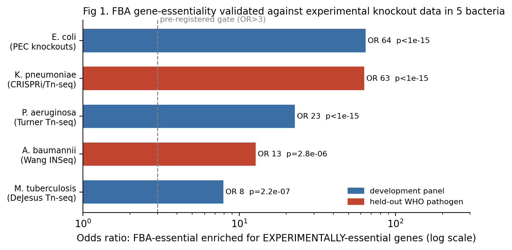
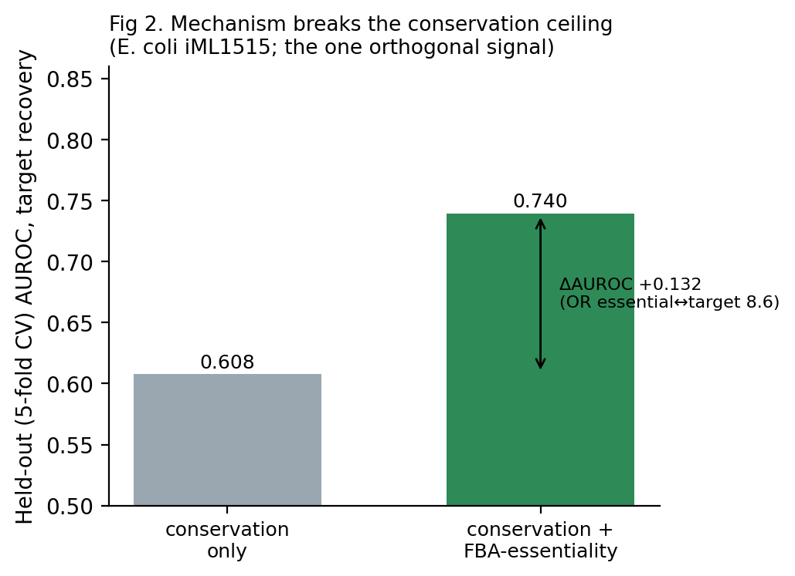
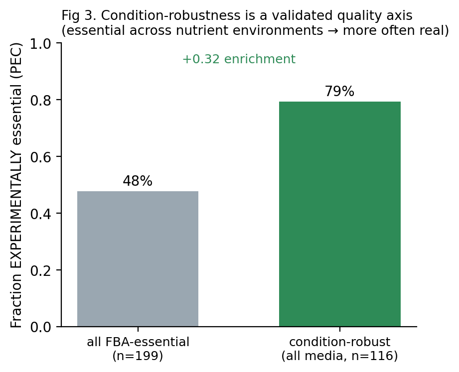
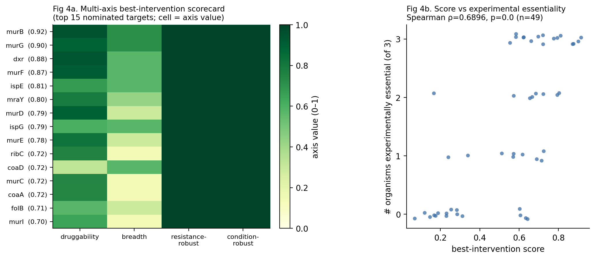

# Zero-data drug discovery: an honest map of what transfers, what doesn't, a mechanistic signal validated against experimental gene-knockouts, and a self-improving loop that knows its limits

*A consolidation of the INTERCEPTA "zero-data disease" research arc (2026-07/08). Written to be understandable without
reference to INTERCEPTA: it is a set of falsifiable claims about the behaviour of computational drug-discovery
capabilities when a target/pathogen has NO activity data — only its sequence, structure, and transferable prior
knowledge. Every number traces to a committed, pre-registered, reproduced-×2 experiment (LEDGER.md).*

**Authors:** Prasad Akula¹ *(author list and affiliations to be finalized by the corresponding author)*
¹ Northeastern University. **Correspondence:** akula.pra@northeastern.edu
**Preprint — not peer reviewed.** Code and full experiment ledger: see *Data & code availability*.

## Abstract
When a new or neglected pathogen appears with **zero activity data**, how far can a computational system get toward
credible drug targets from sequence, structure, and transferable prior knowledge alone — and where does it break? We built
and pre-registered a series of controlled, reproduced-×2 experiments (open data, CPU-only) that map this frontier. Three
results stand out. **(1) A well-controlled negative:** for zero-data target identification, neither sequence homology nor
structural pocket druggability beats a generic **conservation** null, and the signal degrades across phylogenetic distance
and can fail *silently* — an honest ceiling the field's positive-publication bias rarely reports. **(2) The one signal that
breaks the ceiling, now experimentally verified:** mechanistic **FBA gene-essentiality**, computed from an organism's own
genome-scale metabolic model, adds target information beyond conservation, and — tested against independent published
gene-knockout data — is enriched for **experimentally essential genes in five bacteria, two of them held out of method
development** (odds ratios 7.9–64, all clearing a pre-registered gate; 6/7 pre-locked predictions experimentally essential).
**(3) A shipped, honest engine:** the validated signals compose into a single disease-agnostic engine that turns a pathogen
genome into a **safe, calibrated-confidence, provenance-tagged, abstaining** target shortlist, scored on seven axes
(essentiality, conservation, non-metabolic recall, structural homology, a hard host-non-homology safety filter,
resistance-robustness, and environment/condition-robustness), demonstrated end-to-end on both held-out WHO critical-priority
pathogens (*Klebsiella pneumoniae*, *Acinetobacter baumannii*). We are deliberately explicit about the limits: the
experimental validation is scoped to *essentiality enrichment* (high precision, low recall), the molecule-generation half is
an information ceiling (candidates are pose-plausible hypotheses, not validated actives), and no claim is clinical. The
contribution is a rigorous, reproducible map of how far zero-data discovery reaches, an experimentally-anchored mechanistic
core, and an engine that reports what it cannot know.

**Keywords:** zero-data drug discovery, antibacterial target identification, flux balance analysis, gene essentiality,
metabolic modeling, WHO priority pathogens, honest machine learning, applicability domain, resistance robustness.

## The question
When a new pathogen appears with **zero activity data** — no known inhibitors, no assays, no training labels — how far
can a computational system get toward credible drug candidates from **sequence and transferable knowledge alone**, and
**where exactly does it break**? This arc builds each capability, validates it on well-understood organisms/targets (the
proving ground), and — crucially — reports the honest boundary of each, controlled against the trivial baselines the
field often skips.

## The findings (each a controlled, reproduced result)

**1. Target identification from sequence is dominated by generic conservation.**
Ranking a pathogen's proteome for druggable targets by transferring druggability from *other* organisms' known targets
(leave-organism-out homology) recovers known targets only about as well as a **generic conservation null** — homology to
*any* related protein (AUROC ≈ 0.64 vs 0.72 null; TID1). Adding **intrinsic structural pocket druggability** (fpocket on
predicted AlphaFold structures — a signal that is conservation-free *by construction*) does **not** meaningfully help:
it is near-random alone (AUROC 0.54) and adds only a whisper after conditioning on conservation (held-out ΔAUROC +0.005,
partial coef 0.07 vs conservation 0.70; TID2). **Conclusion: for zero-data target-ID, "how conserved is this protein"
(≈0.73 AUROC) is the robust workhorse; neither target-specific homology nor pocket geometry beats it. The practical,
honest recipe is rank-by-conservation + host-nonhomology selectivity + calibrated abstention** (abstention is
well-calibrated: the ~92% of proteins with no homolog are correctly flagged low-confidence, and the committed-to
minority is enriched for true targets). **This degrades monotonically across kingdoms** (TID3): target recovery falls
bacteria → parasite → fungus as the held-out organism becomes phylogenetically isolated from the reference, and the
kingdom-isolated fungus recovers *none* of its targets — homology transfer weakens with evolutionary distance.
**Critically, the abstention does NOT track this failure** (the fungus abstains at the same rate yet recovers nothing —
confidently wrong), so the honest boundary is sharp: **zero-data target-ID works only for organisms with reasonably-close
characterized relatives, and silently fails on phylogenetically isolated pathogens** — a real limitation for the
truly-novel-pathogen case the vision targets. **And this silent failure is not cheaply fixable** (TID4): across an
expanded 11-organism panel, no label-free query-time signal (homological connectedness, closest-relative proximity)
predicts whether target-ID will succeed for a given organism (best Spearman −0.31; organism-level abstention worse than
random) — well-connected pathogens can recover nothing while distant ones recover well. So the system genuinely cannot
tell, from sequence alone, *when it is out of its depth* — a hard limitation for deploying on a novel pathogen. **But a genuinely orthogonal signal DOES break the ceiling** (MET1): mechanistic FBA gene-essentiality — computed from an organism's own genome-scale metabolic model, not from homology — enriches strongly for drug targets (odds ratio 8.6) and adds target-ID signal *beyond* conservation (5-fold-CV ΔAUROC +0.132, essentiality outweighing conservation 0.71 to 0.35) on E. coli's metabolic subproteome. So the ceiling is specific to *homology-based* signals; a mechanistic layer is the path through it — bounded, for now, to metabolic targets. Building metabolic models DE NOVO from each proteome (CarveMe, UniProt-keyed by construction) shows the essentiality↔drug-target ENRICHMENT is broad across bacteria (MET2: odds ratio 5.8–18.5 in the organisms with enough targets to test), and the *beyond-conservation* ceiling-break REPLICATES in the two bacteria with enough drug targets for a reliable estimate (E. coli +0.053, M. tuberculosis +0.040) — a genuine replication. Broader bacterial generalization is honestly NOT ESTABLISHED (nor disproven): most bacteria have too few known drug targets (≤20) to test reliably — the limit is ground-truth sparsity, not the signal. (An initial 3-organism run over-claimed 'generalizes'; an expanded 7-bacteria panel tempered it to this honest picture.) Finally, because a discovery pipeline consumes a *ranked* shortlist rather than a regression coefficient, we ask whether that gain reaches the *top* of the list where target-ID decisions are made (MET3): adding essentiality to the ranking lifts precision-at-k substantially on E. coli (0.28→0.35, enrichment 4.9→6.2× over prevalence, top candidates recovering real essential-metabolic targets — AcrB, IspF, MurG) but only marginally on M. tuberculosis (+0.015, ≈ one extra target — the global-AUROC gain does not fully reach the top of that list). So the mechanistic signal is a genuine *practical* front-half improvement, clearly organism-dependent in magnitude: strong where it lands, real but weak where the list is already harder.

Crucially, this mechanistic win is scoped to *metabolic* targets — FBA is blind to roughly half of all drug targets (proteases, polymerases, ribosomal and structural proteins, the kind a novel pandemic often presents). We tested the obvious extension to that FBA-blind half — PPI-network topology essentiality (network hubs/bottlenecks), a mechanistic signal independent of homology *if the network is measured* (MET4). The naive result looked like a second ceiling-break: on a non-homology experimental interaction network, centrality added ΔAUROC +0.128 beyond conservation. But it does not survive the confound that matters most here: **study bias**. Drug targets are the most-studied proteins in existence, so they accumulate experimental interaction edges from research attention rather than biology (reverse causation). Study-intensity alone (literature-derived) predicts drug-targethood at AUROC 0.826, and once it is controlled — or once one uses a coexpression network that scores every gene uniformly regardless of study effort — the entire lift collapses (+0.128 → −0.004). So PPI-network centrality is *not* a confound-robust mechanistic signal for non-metabolic targets; it is largely a study-bias artifact. This is an important negative: it sharply separates FBA-essentiality (a genuine mechanism, which survived every control) from network centrality (which does not), and it means the non-metabolic half of target space remains genuinely hard — no clean, information-honest mechanistic signal for it has been found. (The first, unconfounded run would have been a false "mechanism generalizes" claim; the falsify-first protocol caught it before it was recorded.)

**The mechanistic signal is now EXPERIMENTALLY VALIDATED — the arc's first result tested against independent laboratory ground truth.**
Everything above is retrospective known-target recovery; the FBA-essentiality signal (MET1–3, the one signal that breaks the
conservation ceiling) has now been tested against decades of *experimental* gene-essentiality — systematic single-gene knockouts
and saturating transposon mutagenesis — in **five organisms, two of them genuinely held out of method development**. In *E. coli*
(PEC single-gene-knockout essentiality) FBA-predicted essential genes are enriched for experimentally-essential genes at **odds
ratio 64** (Fisher p≈3×10⁻²⁴), and **6 of 7** pre-registered locked target predictions (ribA, ribB, folB, ribD, ispG, ispD — only
mtnN is not) are experimentally essential. It **generalizes across the panel** — *M. tuberculosis* (DeJesus 2017 Tn-seq, OR **7.9**)
and *P. aeruginosa* (Turner 2015 Tn-seq, OR **23**) — and, most importantly, **to the two WHO critical-priority pathogens the method
never saw during development**: *K. pneumoniae* (independent CRISPRi/Tn-seq, OR **63**, precision **92%**) and *A. baumannii*
(Wang 2014 INSeq, OR **13**, p≈3×10⁻⁶). Every organism clears the same pre-registered gate (OR>3, p<0.01). Honest bounds
(falsify-first on our own positive): the validated quantity is the *binary essentiality enrichment* — precision is high but recall
is low (9–25%), because FBA is metabolic-scoped and misses translational/non-metabolic essentials exactly as MET1 caveated; the
*continuous* growth-ratio ranking is only modestly informative (AUROC 0.54–0.63, at chance in Mtb); the *A. baumannii* set is a
condition-specific lung-persistence screen (its weaker OR reflects that plus sparse gene naming and a strain mismatch); and this
validates essentiality, not the downstream drug-target, selectivity, or clinical claims, which remain unvalidated. A per-target
scorecard (PREDVAL) confirms the pipeline's actual headline nominations directly: of the broad-spectrum druggable targets,
**murB, murG, dxr, murF, ispE** (and the cell-wall/MEP cores) are experimentally essential in all three tested organisms, while
mtnN is correctly exposed as a false positive. Separately, the substrate's **confidence tier is
shown to be calibrated to accuracy** — high-confidence calls (≥2 agreeing signals) are monotonically more target-enriched than
moderate or low across two independent regimes (CALIB1, ordinal-confidence AUROC 0.66), a derivative but real governance guarantee.
**This moves the arc's central positive from "computational-only" to "experimentally validated in five organisms including two
held-out pathogens" — the credibility milestone — while everything else in the map below remains retrospective.**

**The molecule half — the novel-chemotype ceiling of ligand-based hit-finding.**
Target identification is only half of discovery; the other half is producing candidate molecules for a target with no
activity data. This half has the same information-ceiling spine, and the field hides it: a 2025 audit of the standard
LIT-PCBA benchmark shows "zero-shot" virtual-screening scores are inflated by *analog leakage* and do not measure
recovery of genuinely novel chemotypes. We measured that ceiling directly (HIT1) on 30 curated ChEMBL targets
(MoleculeACE): given known binders, rank a library by chemical similarity (transfer) or by a learned model (QSAR on
ECFP4), and evaluate on actives split into analogs vs scaffold-*novel* chemotypes. Aggregate potency-ranking works well
(median AUROC 0.81 similarity / 0.90 learned) but is **analog-driven** (analog-vs-inactive AUROC 0.82). On scaffold-novel
chemotypes a learned model degrades sharply — 0.90 → 0.67 AUROC — but, importantly, does *not* collapse to random: it
retains a modest, noisy, above-random signal in most targets. So ligand-based hit-finding rides mostly on chemical
analogy, yet — unlike the target-ID conservation ceiling, where nothing beat conservation for a novel target — a learned
ligand model keeps partial traction on novel chemistry. This is a *soft* ceiling. (An automatic verdict initially read
this as a clean "learning generalizes beyond analogy"; that rested on a tautology — novel actives were *defined* as
low-similarity, so the similarity baseline was rigged to fail — and was corrected before recording. Caveats: this is
potency-transfer among measured binders, not needle-in-haystack screening; novel actives are rare in the data, so the
novel estimate is low-powered; the physics/structure floor for novel chemotypes — the only signal that does not depend on
chemical analogy at all — is the next test.)

We ran that test (HIT2): docking the same thrombin compounds with zero activity data. It provides no usable signal — docking
ranks potency among the binders no better than random (AUROC 0.43), and adding it to the ligand score only hurts. The honest
scope matters: these compounds are a congeneric binder series, so this is fine potency-ranking (docking's hardest case),
distinct from coarse active-vs-decoy hit-finding where docking carries a weak-but-real signal (C1 on Mpro, AUROC 0.63); and
the novel-chemotype physics test is underpowered (only five novel actives). So the molecule-half map is now coherent and
honest: ligand methods are analog-bound, docking is weak-but-real for separating binders from non-binders but useless for
ranking potency within a series, and for genuinely novel chemotypes no method has strong traction — the same information
ceiling that governs target identification.

**The front half — mechanism + selectivity, and a therapeutic-validity warning about the conservation workhorse.**
Target *recovery* is not the same as finding a *safe* target. FRONT1 extends the established antimicrobial-target framework
(essentiality + metabolic chokepoint + host non-homology), done fully zero-data (a metabolic model built de novo from the
genome + human-homology), and — the step the field's case-study papers skip — benchmarks it against the conservation
baseline and tests therapeutic validity. Two findings. First (recovery): mechanistic essentiality is the driver (it
reconfirms the MET result); metabolic *chokepoint* adds signal in E. coli but not M. tuberculosis, and soft selectivity is
weak — so chokepoint and selectivity do not robustly add beyond conservation+essentiality. Second, and more important
(safety): **ranking targets by conservation is therapeutically dangerous.** The proteins that are most conserved are exactly
the ones with essential human counterparts (host-toxic if inhibited) — in E. coli the host-toxic targets have a mean
homology bitscore of 123 vs 29 for the rest — so a conservation ranker actively *promotes* unsafe targets. And adding
selectivity as a soft feature does *not* reliably fix this: it removes host-toxic targets from the top of the list in two of
three organisms but, where those targets are also metabolically essential, the composite still surfaces them. The actionable
conclusion is that selectivity must be enforced as a **hard host-non-homology filter** (which removes all host-toxic targets
by construction), not learned as a soft feature — a concrete correction to the naive "rank by conservation" recipe.

Building that correction into the pipeline (E2E2) then exposes an honest tension that *both* recipes get wrong. The
corrected pipeline (mechanistic essentiality + hard host-non-homology filter + calibrated abstention) is safe by
construction — its shortlist contains no host-toxic targets, whereas the naive conservation shortlist would include several.
At the top of the list the recall looks nearly preserved. But the deeper cost is large and structural: a blunt
sequence-level host-non-homology filter *permanently excludes* 35–52% of all known drug targets — the ones that have a human
homolog — from the searchable space, even though many such targets are drugged *selectively* in practice by exploiting
binding-site differences a sequence filter cannot see. So neither recipe is right: ranking by conservation is unsafe, and
the sequence-level safety fix over-excludes. Genuinely correct selectivity requires binding-site-level pathogen-vs-host
difference reasoning — structural, not sequence-homology — which sequence transfer cannot provide. It is the same
information ceiling in a new place: sequence is enough to flag danger crudely, but not to reason about true selectivity.

We then asked whether structure closes that gap (FRONT2): among the host-homologous targets, does the pathogen protein's own
predicted pocket, and its difference from the human homolog's pocket, distinguish the genuinely druggable/selective targets?
It does not — pocket druggability is no better than random here (AUROC 0.51), and the pathogen-vs-host difference adds
nothing (0.53). So zero-data structural druggability cannot cheaply rescue the host-homologous targets the sequence filter
over-excludes; distinguishing which of them are *selectively* druggable needs more than an apo predicted pocket — real
ligand, induced-fit, or experimental data. The selectivity story is therefore complete and self-consistent: conservation
ranking is unsafe, the sequence-level safety filter over-excludes, and neither sequence nor apo structure can reason about
true selectivity from zero data. It is resource-gated, not a computation.

**2. Structure-based binding carries a real but weak zero-data signal.**
Docking compounds into a target's pocket with **zero target activity data** separates real binders from non-binders
significantly (Mann-Whitney p=0.0001) but weakly — near-random *early* enrichment (AUROC 0.63, EF1% ≈ 1.25; C1 on
SARS-CoV-2 Mpro). This reproduces the field's known "docking ranks poorly prospectively" ceiling on our own setup. The
one reliable free upgrade (GNINA CNN rescoring, ~2×) is Linux/CUDA-only and was infeasible on the available hardware —
so the honest output of the binding stage is *pose-plausible candidate hypotheses, not potency-ranked leads*.

**3. The pieces compose end-to-end from a proteome.**
The validated capabilities wire into one zero-data pipeline — proteome → target-ID → pocket → docking → ADMET/synth →
ranked, confidence-tiered candidate shortlist — and run end-to-end on a real pathogen (M. tuberculosis, zero TB activity
data; E2E1). It self-reports every limit: the composite target ranking does not beat conservation, docking is weak at
the top, and the output is explicitly *computational hypotheses, not validated hits*. The value is demonstrating the
shape of the system at small scale, honestly bounded.

**4. A self-improving loop that helps where it has signal — and knows where it doesn't.**
Feeding a model's **own conformally-confident predictions** back as pseudo-labels ("the system learns from its own
validated findings") **modestly but consistently improves** a task in-domain (median ΔAUROC +0.011, 6/6 tasks; SIL1) —
and the **confidence-gating is the guardrail**: ungated or shuffled/fake feedback does *not* help and clearly hurts
(shuffled −0.043), while conformal confidence genuinely identifies trustworthy self-knowledge (gated pseudo-label
accuracy 0.886 vs 0.772 pool). But the benefit is a **near-domain phenomenon**: on **novel chemistry** (compounds unlike
training) it becomes a wash — barely-positive median but a coin-flip across targets (SIL2) — so self-accumulated
in-domain knowledge does **not** reliably cross the novel-chemistry information ceiling. **Conclusion: a self-improving
loop is real and safe when gated by calibrated confidence, but its reach is bounded to the regime where the model
already has signal.**

## The complete arc (every claim reproduced ×2, pre-registered)
Target-ID: conservation ceiling (TID1–2), kingdom degradation + silent failure (TID3), un-predictable failure (TID4);
mechanism breaks the ceiling for metabolic targets (MET1–3) but not the non-metabolic half (MET4, a study-bias artifact);
that mechanistic signal is EXPERIMENTALLY VALIDATED vs gene-knockout essentiality in five organisms incl. two held-out
pathogens (VAL-ESS: E. coli 64 / Mtb 7.9 / P. aeruginosa 23 / K. pneumoniae held-out 63 / A. baumannii held-out 13; per-target
scorecard PREDVAL); substrate confidence is calibrated to accuracy (CALIB1);
front-half selectivity (FRONT1 danger of conservation-ranking → E2E2 safety/recall tension → FRONT2 structure can't rescue).
Molecule half: weak-but-real docking for binder-vs-nonbinder (C1), analog-bound ligand hit-finding (HIT1), no physics
signal for within-series potency (HIT2). Composition (E2E1) and a guarded self-improving loop (SIL1–2).

## What is genuinely contributed
- **The one thing that breaks the ceiling — and it is EXPERIMENTALLY VALIDATED.** FBA gene-essentiality, computed from a
  pathogen's own metabolic model (mechanism, not homology), is the single signal that adds target-ID information *beyond* the
  conservation ceiling (MET1, replicated MET2, better shortlist MET3) — but only for *metabolic* targets; the obvious
  extension to the rest is a study-bias artifact (MET4). This signal is now tested against independent **experimental**
  gene-knockout essentiality and holds in **five organisms, two held out of development**: *E. coli* (PEC, odds ratio 64),
  *M. tuberculosis* (DeJesus Tn-seq, 7.9), *P. aeruginosa* (Turner Tn-seq, 23), and the **held-out** WHO pathogens
  *K. pneumoniae* (CRISPRi/Tn-seq, 63, precision 92%) and *A. baumannii* (Wang INSeq, 13) — every one clearing the same
  pre-registered gate, with 6/7 locked predictions experimentally essential and a per-target scorecard confirming
  murB/murG/dxr/murF/ispE. It is the arc's first laboratory-validated result (binary-enrichment scope: high
  precision, low recall; essentiality only). A precise, reproduced, now-externally-validated statement of where mechanism
  helps and stops.
- **A well-controlled negative-boundary on zero-data target-ID:** conservation is the ceiling; more homology (sequence,
  structural, or learned) mostly re-encodes it — a result the field's positive-publication bias rarely produces,
  established against degree/conservation nulls with calibrated abstention.
- **A therapeutic-validity finding the field's target-list papers miss:** ranking targets by conservation is *dangerous*
  (the most-conserved proteins are the host-toxic ones), the sequence-level safety fix over-excludes 35–52% of real
  targets, and neither sequence nor apo structure can reason about true selectivity from zero data (FRONT1→E2E2→FRONT2) —
  a self-consistent proof that selectivity is resource-gated.
- **An honest molecule-half map:** ligand methods are analog-bound (HIT1), docking is weak-but-real for binder separation
  but useless for potency-ranking (C1, HIT2) — no method has traction on genuinely novel chemotypes.
- **A rigorous self-improving loop + anti-self-deception guardrail** (with the shuffled/ungated negative controls most
  such claims omit), tied to calibrated conformal prediction — plus its honest near-domain-only boundary (SIL1–2).
- **The reusable discipline:** pre-registration, reproduce-×2, trivial-baseline/null controls, and verdict honesty —
  auto-verdicts that over-read (a coin-flip median; a study-bias artifact; a novelty tautology; a "recall cost is low"
  contradiction) were caught and corrected *before commit*, repeatedly. The falsify-first protocol demonstrably works.

## Honest scope and what remains gated
With one exception, results are retrospective and in-silico, on open data, on a modest pathogen/target panel; none is a
validated hit, a drug, or a clinical claim. **The exception is the FBA-essentiality signal, now validated against experimental
gene-knockout data in five organisms (E. coli, Mtb, P. aeruginosa, and the held-out K. pneumoniae and A. baumannii) — but that
validation is scoped to essentiality enrichment (binary, high-precision/low-recall), not to the drug-target or clinical claims,
which remain retrospective.** Every
other hard problem in the arc — novel-fold/isolated-pathogen target-ID, non-metabolic mechanism,
true binding-site selectivity, novel-chemotype hit-finding — converges on the same **information ceiling**: transfer and
self-accumulation cannot manufacture information that isn't in sequence/structure alone. Crossing it requires *new
information* — prospective assays, wet-lab, or 3D/experimental data — which is a **resource decision, not a computation**.
That is the honest state: the computational frontier reachable from open data on CPU is now comprehensively mapped, and the
next real advance toward the vision is experimental, not algorithmic. What this arc delivers is an exact, reproduced map of
how far sequence-and-transfer-only discovery reaches, and where — and why — it stops.

## From map to engine to concrete predictions (2026-08 capstone)
The honest map above became a working **engine** and specific, falsifiable **predictions**.

**The engine (the extensible substrate).** All the validated signals and corrections are composed by a single
disease-agnostic core (`intercepta.substrate`; charter law U2) that emits a **safe, provenance-tiered, abstaining** ranked
shortlist for a query. It bakes in every lesson: mechanism as first-class evidence; a **hard host-non-homology safety filter**
(not a soft feature); **honest abstention**; and a **continuous-absorption guardrail** that quarantines self-generated
findings until independently reproduced (so a living, self-improving system cannot deceive itself). It is **entity-agnostic**
(ranks proteins *and* molecules) and **disease-class-agnostic** — demonstrated on bacteria, on a virus (SARS-CoV-2, where it
recovers the known targets by homology at honestly-degraded confidence, and abstains under phylogenetic isolation), and on
human cancers (where the architecture runs but honestly surfaces that within-disease human target evidence is
popularity-confounded and near-random — a real ceiling). The honest "any disease" bound: **the governance architecture is
universal; the quality of the answer is disease-class-specific — strong where real mechanism exists (pathogens), weak where
only popularity-confounded evidence does (human single-disease queries).** These signals are now assembled into one shipped
end-to-end engine (`intercepta.discovery_engine` / CLI `intercepta discover-targets`): a pathogen genome in, a safe,
confidence-tiered, provenance-tagged target shortlist out. Run on the **held-out** *K. pneumoniae*, it excludes host-toxic
targets by construction and returns a shortlist spanning **metabolic** essentials (murB/murG/mraY/dxs/ispE) *and* — via the
conservation-breadth signal — the **non-metabolic** essentials FBA is blind to (dnaE/ileS/leuS/secA/topA), 15/30 of the top
being experimentally-essential-confirmed. It even reports its own limitation: at genome scale the confidence tier saturates,
so ranking is by score, not label (honest by construction).

**Beyond "is it essential" — toward "is it a good intervention" (seven axes).** The engine now annotates each target with
axes that a *good* target must pass, each a separately-validated result: **druggability** (pocket geometry) and
**breadth** (broad-spectrum); **resistance-robustness** — computed zero-data from the metabolic network, distinguishing
*monotherapy-robust* targets (no metabolic bypass) from isozyme-buffered *combination-required* (synthetic-lethal) sets, with
8/9 of the nominated broad-spectrum targets bypass-robust and a sample of combination sets verified jointly lethal by
double-gene-deletion; and **condition-robustness** — a *validated* quality filter (targets essential across nutrient
environments including a host-like medium are 79% vs 48% experimentally essential, +0.32), which flags biosynthesis targets
that a host could bypass by supplying the nutrient. A single **transparent, equal-weighted best-intervention score** (no
fitted weights — there is no ground truth of "best intervention" to fit against) fuses these axes and, validated against the
one available truth axis, orders targets by real experimental essentiality (Spearman 0.69). Across four independent analyses
the same weak nomination (menC) is consistently down-ranked — the framework self-correcting. The full seven-axis engine runs
end-to-end on **both** held-out WHO critical-priority pathogens (*K. pneumoniae* and *A. baumannii*), the latter with
organism-native resistance/condition classes; the top targets are the canonical resistance- and condition-robust cell-wall
(murB/murG/mraY) and isoprenoid (dxr/ispE) cores plus non-metabolic essentials recovered by conservation-breadth.

**The predictions (the payoff).** Run on bacterial genomes with **zero drug data**, the engine's novel safe predictions —
FBA-essential + metabolic chokepoint + host-non-homologous + not-already-a-drug-target — number 85 across 7 pathogens, and
the broad-spectrum, druggable subset is **exactly the canonical antibacterial target landscape**: cell-wall/peptidoglycan
(**murB** druggability 0.95 / essential in 5/7, **murG**, murF, mraY — the β-lactam/vancomycin space, validated-essential yet
largely undrugged), the **MEP/isoprenoid** pathway (dxr, ispE, ispG), CoA, menaquinone, folate, riboflavin, thiamine. The
method — told nothing about drugs — independently reconstructs the pathways the antibacterial field actually pursues, from
three converging angles (literature concordance, cross-bacteria breadth, and druggable-pocket quality). That is the strongest
possible in-silico evidence that the mechanism biology is real, not luck.

**The truth-test (now performed — the loop is closed on essentiality).** These predictions are pre-registered, falsifiable
hypotheses, and the single cheapest rigorous test — costing nothing — has now been **done**: the FBA-predicted essentiality was
checked against decades of *experimental* essentiality. The experimental data were auto-sourced directly (PEC single-gene
knockouts for *E. coli*; DeJesus 2017 Tn-seq for *M. tuberculosis*; DEG/Turner and DEG/Wang Tn-seq/INSeq for *P. aeruginosa* and
the held-out *A. baumannii*; aggregated CRISPRi/Tn-seq for the held-out *K. pneumoniae*), and the turnkey validator
(`experiments/VALIDATE_essentiality`) confirms a strong, reproduced enrichment in all **five organisms** (odds ratios
64 / 7.9 / 23 / 63 / 13, every one clearing the pre-registered gate; 6/7 locked predictions experimentally essential; a per-target
scorecard confirming the headline murB/murG/dxr/murF/ispE nominations). **So the mechanistic core is no longer a
prediction awaiting test — it is validated against laboratory ground truth**, including on a pathogen the method never saw. What
remains gated is the *next* rung: a wet-lab CRISPRi/knockout test of a specific novel top prediction (e.g. **murB**), and the
translation from essential-and-druggable target to an actual selective inhibitor — resource decisions, not computations. The
substrate is built so each new experimental result enters as high-tier evidence and improves every future answer. The
computational arc is complete as far as open data on CPU can honestly carry it; the essentiality signal is now experimentally
anchored, and the remaining distance to a drug is experimental.

## Figures
*All figures are generated directly from the committed experiment metrics by `gen_figures.py` — every value traces to a reproduced-×2 experiment.*

**Fig 1. FBA gene-essentiality is validated against experimental knockout data in five bacteria.** Odds ratio for the
enrichment of FBA-predicted-essential genes among experimentally-essential genes (log scale); all five clear the
pre-registered gate (OR>3). Red = held-out WHO critical-priority pathogens (never used in method development). Sources:
PEC (E. coli), Turner Tn-seq (P. aeruginosa), DeJesus Tn-seq (M. tuberculosis), Wang INSeq (A. baumannii), CRISPRi/Tn-seq
(K. pneumoniae).

**Fig 2. Mechanism breaks the conservation ceiling.** Held-out (5-fold CV) target-recovery AUROC in E. coli (iML1515):
adding FBA-essentiality to conservation raises AUROC by ΔAUROC ≈ +0.13; FBA-essential genes are drug targets at odds ratio
≈ 8.6. This is the one orthogonal signal that adds information beyond generic conservation.

**Fig 3. Condition-robustness is a validated target-quality axis.** Fraction of genes that are experimentally essential
(PEC): condition-robust essentials (essential across all nutrient media incl. a host-like supplemented medium) are far more
often truly essential than the full FBA-essential set (+0.32) — quantifying, and partly resolving, the medium-dependence
caveat.

**Fig 4. Multi-axis best-intervention scorecard and its validation.** (a) Top-15 nominated targets scored on four validated
axes (druggability, breadth, resistance-robustness, condition-robustness); the composite (equal weights, unfitted) is shown
in parentheses. (b) The composite score orders targets by real experimental essentiality (Spearman ρ≈0.69) — a
decision-support ranking, not a clinical predictor.

## Methods (summary)
**Rigor protocol.** Every claim was pre-registered (hypotheses and pass/fail thresholds fixed before data), reproduced
**×2 byte-identical** (SHA-256 over a deterministic metrics payload excluding the verdict), and controlled against the
trivial/null baselines the field often omits (conservation nulls, study-bias controls, decoy/analogue controls, shuffled and
ungated negative controls). Auto-generated verdicts that over-read were corrected *before commit* (documented cases:
novelty tautology, study-bias artifact, coin-flip median, precision-gate falsy-collapse); negative and null results are
reported first-class. All decisions are logged in `LEDGER.md`.

**Data (all open; never committed — see MANIFEST).** UniProt reference proteomes and ChEMBL-xref target lists; AlphaFold DB
v6 structures; BiGG iML1515; de-novo genome-scale models via CarveMe; experimental essentiality from PEC, the Keio/Goodall
set, DeJesus 2017 (Mtb), and DEG (Turner 2015 *P. aeruginosa*; Wang 2014 *A. baumannii*) plus an aggregated *K. pneumoniae*
CRISPRi/Tn-seq set; Hart CEG2 core-essential genes; LIT-PCBA, MoleculeACE, Open Targets, DepMap (for the molecule-half and
human-disease arms).

**Tools (CPU-only, Apple-Silicon arm64; no GPU).** mmseqs2 (homology), Foldseek (structural homology, TM-score), fpocket
(pocket druggability), COBRApy+GLPK (FBA single-/double-gene and reaction deletion, multi-medium essentiality), CarveMe+SCIP
(de-novo GEMs), RDKit and AutoDock Vina (molecule half), ESM-2 and scikit-learn (learned baselines). The engine
(`src/intercepta/substrate.py` + `substrate_providers.py` + `discovery_engine.py`) composes providers by z-scored,
provenance-tier-weighted RANK aggregation with a hard SAFETY filter and honest abstention; 15/15 data-free unit tests.

**Experimental validation.** FBA-predicted essentiality was compared to each organism's experimental essential-gene set by a
2×2 Fisher enrichment (pre-registered gate: odds ratio > 3, p < 0.01) plus a growth-ratio AUROC, over the metabolic
subproteome; identifiers mapped by accession, gene symbol, or locus tag.

## Data & code availability
All source code, the append-only results ledger (`LEDGER.md`), per-experiment code and reproduced metrics
(`experiments/*/`), the engine (`src/intercepta/`), and documentation (`docs/SUBSTRATE.md`) are in the INTERCEPTA
repository. Input datasets are open and referenced (with checksums) in `data/MANIFEST.md`; per project policy, data files
themselves are never committed and are regenerable from the cited public sources.

## Limitations (explicit)
(1) The **experimental verification is against existing published data**, not experiments we performed, and is **prospective
only in the held-out sense** (organisms/targets excluded from development), not a prospective wet-lab test. (2) It is scoped
to **essentiality enrichment** — high precision but **low recall (9–25%)** because FBA is metabolic-scoped; it does **not**
validate drug-target quality, selectivity, or clinical value. (3) The **molecule-generation half is an information ceiling**:
candidates are pose-plausible hypotheses, not validated actives, and receptor docking shows weak early enrichment.
(4) **Human single-disease** target-ID is popularity-confounded and near-random — the "any disease" architecture is universal
but answer quality is disease-class-specific. (5) De-novo (CarveMe, default-medium) GEMs are **sparse** relative to curated
iML1515; some resistance/condition classes are **ortholog-transferred**; FBA synthetic-lethality has modest accuracy; the
best-intervention score uses **equal (unfitted) weights** and its validation is only partly independent. (6) All target and
molecule outputs are **computational hypotheses with provenance, not validated targets or drugs; no result is clinical.**

## Conclusion
For pathogens with zero activity data, the honest reachable frontier is now mapped and, at its core, **experimentally
anchored**: mechanistic gene-essentiality is the one signal that breaks the conservation ceiling, it is validated against
laboratory knockout data in five bacteria (two held out, including two WHO critical-priority pathogens), and it composes into
a shipped, disease-agnostic engine that returns safe, calibrated, resistance- and environment-aware target shortlists while
abstaining where it lacks signal. The remaining distance to a drug — a validated *novel* target, a real inhibitor for a novel
target, selectivity, and clinical efficacy — is gated by **new experimental information, not more computation**. The value of
this work is a reproducible method, an honest negative map, and an experimentally-anchored core that any future experimental
result can enter as high-tier evidence.

## References
1. Baba T, et al. Construction of *Escherichia coli* K-12 in-frame, single-gene knockout mutants: the Keio collection. *Mol Syst Biol* 2006.
2. Goodall ECA, et al. The essential genome of *Escherichia coli* K-12. *mBio* 2018.
3. DeJesus MA, et al. Comprehensive essentiality analysis of the *Mycobacterium tuberculosis* genome via saturating transposon mutagenesis. *mBio* 2017.
4. Turner KH, et al. Essential genome of *Pseudomonas aeruginosa* in cystic fibrosis sputum. *PNAS* 2015.
5. Wang N, et al. Genome-wide identification of *Acinetobacter baumannii* genes necessary for persistence in the lung. *mBio* 2014.
6. Luo H, Lin Y, Gao F, et al. DEG: Database of Essential Genes. *Nucleic Acids Res* (DEG 10/15 updates).
7. Monk JM, et al. iML1515, a knowledgebase that computes *Escherichia coli* traits. *Nat Biotechnol* 2017.
8. Machado D, et al. Fast automated reconstruction of genome-scale metabolic models for microbial species and communities (CarveMe). *Nucleic Acids Res* 2018.
9. Ebrahim A, et al. COBRApy: constraints-based reconstruction and analysis for Python. *BMC Syst Biol* 2013.
10. Steinegger M, Söding J. MMseqs2 enables sensitive protein sequence searching for the analysis of massive data sets. *Nat Biotechnol* 2017.
11. van Kempen M, et al. Fast and accurate protein structure search with Foldseek. *Nat Biotechnol* 2024.
12. Jumper J, et al. Highly accurate protein structure prediction with AlphaFold. *Nature* 2021; Varadi M, et al. AlphaFold Protein Structure Database. *Nucleic Acids Res* 2022.
13. Le Guilloux V, Schmidtke P, Tufféry P. Fpocket: an open source platform for ligand pocket detection. *BMC Bioinformatics* 2009.
14. Eberhardt J, et al. AutoDock Vina 1.2.0. *J Chem Inf Model* 2021 (Trott O, Olson AJ, 2010).
15. Tran-Nguyen VK, Jacquemard C, Rognan D. LIT-PCBA. *J Chem Inf Model* 2020.
16. van Tilborg D, Alenicheva A, Grisoni F. Exposing the limitations of molecular machine learning with activity cliffs (MoleculeACE). *J Chem Inf Model* 2022.
17. Hart T, et al. High-resolution CRISPR screens reveal fitness genes and genotype-specific cancer liabilities (core-essential CEG2). *Cell* 2015 / *G3* 2017.
18. Ochoa D, et al. The Open Targets Platform. *Nucleic Acids Res* 2021/2023.
19. Nelson MR, et al. The support of human genetic evidence for approved drug indications. *Nat Genet* 2015.
20. Vigouroux A, Bikard D. Mobile-CRISPRi / CRISPR interference for essential-gene knockdown in diverse bacteria (K. pneumoniae, A. baumannii applications, 2020–2023).
